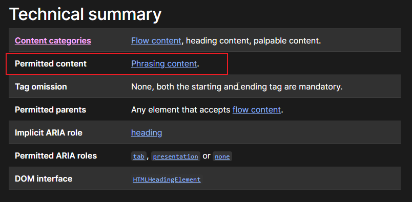

# Ch04L15 元素包含关系

以前：块级元素可以包含行级元素，行级元素不可以包含块级元素，a 元素除外

元素的包含关系由元素的内容类别决定。

例如，查看 `h1` 元素中是否可以包含 `p` 元素，直接在 MDN 查看 `h1` 文档中允许的内容即可（）。

> [!important]
>
> 总结：
>
> 1. 容器元素中可以包含任何元素
> 2. a元素中几乎可以包含任何元素
> 3. 某些元素有固定的子元素（`ul`>`li`，`ol`>`li`，`dl`>`dt`+`dd`）
> 4. 标题元素和段落元素不能相互嵌套，并且不能包含容器元素

`内容类别` MDN 文档：https://developer.mozilla.org/en-US/docs/Web/HTML/Content_categories
