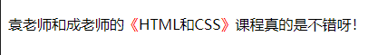

# Ch05L19 选择器

选择器（`selector`）：帮助你精准的选中想要的元素

## 1 简单选择器

1. ID选择器
2. 元素选择器
3. 类选择器
4. 通配符选择器：`*`，选中所有元素
5. 属性选择器：根据属性名和属性值选中元素
6. 伪类选择器：选中某些元素的某种状态（顺序遵循【爱恨法则】：**LoVe HAte**）
   1. `link`：超链接未访问时的状态
   2. `visited`：超链接访问过后的状态（历史记录中存在该链接）
   3. `hover`：鼠标悬停状态
   4. `active`：激活状态，鼠标按下状态

7. 伪元素选择器（`::before`、`::after`）

例如：

```css
span::before {
    content: "《";
    color: red;
}
span::after {
    content: "》";
    color: red;
}
/*HTML:
<p>袁老师和成老师的<span>HTML和CSS</span>课程真的是不错呀！</p>
*/
```

效果：




## 2 选择器的组合

1. 并且
2. 后代元素：`(空格)`
3. 直接子元素：`>`
4. 相邻兄弟元素：`+`
5. 后面出现的所有兄弟元素：`~`

> [!note]
>
> 视频演示了一个语义化错误及调试方法。`p` 元素中不能使用 `ul` 元素，因为 `ul` 的【内容类型】不属于 **短语内容**。因此实际渲染时，`ul` 成了 `p` 的兄弟节点，而不是父子节点。


## 3 选择器的并列

多个选择器, 用单角英文逗号 `,` 分隔（语法糖）


流行色：马尔斯绿（颜色值：`#008c8c`） 
