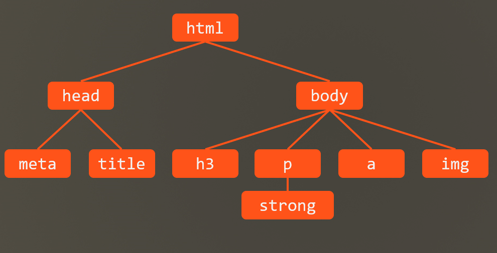

# Ch05L22 属性值的计算过程


## 1 基础知识

一个元素一个元素依次渲染，顺序按照页面文档的树形目录结构进行



渲染每个元素的前提条件：该元素的所有CSS属性必须有值

一个元素，从所有属性都没有值，到所有的属性都有值，这个计算过程，叫做属性值计算过程


## 2 具体计算过程

按如下顺序进行：

1. 确定声明值（开发者或浏览器声明）：参考样式表中 **没有冲突的声明**，作为 CSS 属性值
2. 层叠冲突：对样式表 **有冲突的声明** 使用 **层叠规则**，确定 CSS 属性值
3. 使用继承：对 **仍然没有值的属性**，若 **可以继承**，则继承父元素的值
4. 使用默认值：对仍然没有值的属性，使用 **默认值**

具体过程，详见 PPT。

> [!tip]
>
> 特殊的两个 CSS 取值：
>
> - `inherit`：手动（强制）继承，将父元素的值取出应用到该元素
> - `initial`：初始值，将该属性设置为默认值


> [!note]
>
> **关于 `a` 元素的字体无法自动继承的原因**
>
> ```html
> <style>
> .my-class { color: red; }
> </style>
> <body>
>     <div class="my-class"><a href="#">Anchor Content</a></div>
> </body>
> ```
>
> 上述 `a` 的字体颜色并非红色，而是浏览器默认的样式：
>
> ```css
> a:-webkit-any-link {
>     color: -webkit-link;
>     cursor: pointer;
>     text-decoration: underline;
> }
> ```
>
> 根据计算规则，`a` 的字体颜色在第一步就确定了，根本轮不到使用继承自父级 `div` 的颜色。
>
> 要想 `a` 元素强行使用 `div` 的红色，可以使用 `inherit`：
>
> ```css
> a {
>     color: inherit;
> }
> ```
>
> 或者手动声明 `a` 为红色：`a { color: red; }`，已达到覆盖浏览器默认样式的效果（扩展性差，不推荐）
