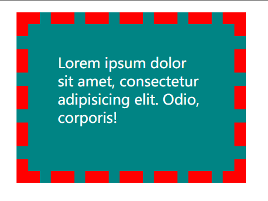
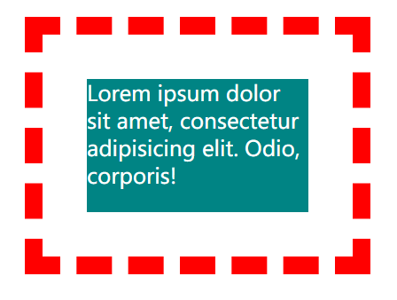
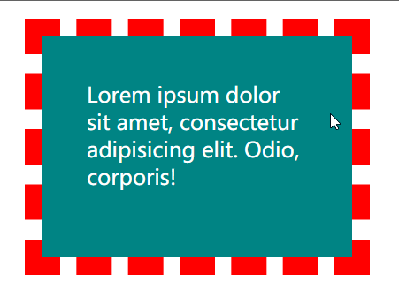

# Ch06L24 盒模型应用


## 1 改变宽高范围

默认情况下，width 和 height 设置的是 **内容盒** 的宽高。

> 页面重构师：将 `psd` 文件（设计稿）制作为静态页面

衡量设计稿尺寸的时候，往往使用的是边框盒；
但设置 `width` 和 `height` 时则设置的是内容盒

解决方案：

1. 精确计算
2. CSS3：`box-sizing`


## 2 改变背景覆盖范围

默认情况下，背景覆盖 **边框盒**

可以通过 `background-clip` 进行修改

```css
div { 
    background-clip: border-box;
    background-clip: content-box;
    background-clip: inherit;
    background-clip: initial;
    background-clip: padding-box;
    /*...*/
}
```

实测：

```css
.child {
  border: 20px dashed red;
  background-color: #008484;
  color: #fff;
  font-size: 1.5em;
  height: 150px;
  width: 250px;
  margin: 20px;
  padding: 50px;
}
/*HTML:
<div class="child">Lorem ipsum dolor sit amet, consectetur adipisicing elit. Odio, corporis!</div>*/
```

效果：

|  |  |  |
| :------------------------------------: | :-------------------------------------: | :-------------------------------------: |
|              `border-box`              |              `content-box`              |              `padding-box`              |


## 3 溢出处理

`overflow`，控制内容溢出边框盒后的处理方式

默认值为 `visible`。除了隐藏溢出部分（`hidden`），还可以生成滚动条（`scroll`）。


## 4 断词规则

`word-break` 属性，会影响文字在什么位置被截断换行——

- `normal`：普通。CJK字符（文字位置截断），非CJK字符（单词位置截断）；
- `break-all`：截断所有。所有字符都在文字处截断；
- `keep-all`：保持所有。所有文字都在单词之间截断；


## 5 空白处理

`white-space`：`nowrap`

单行文本自动省略溢出部分：

```css
li {
    white-space: nowrap;
    overflow: hidden;
    text-overflow: ellipsis;
}
```

