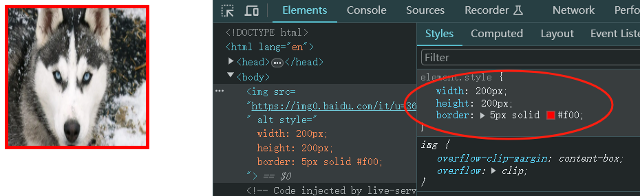

# Ch06L26 行盒盒模型

常见的行盒：包含具体内容的元素

`span`、`strong`、`em`、`i`、`img`、`video`、`audio`


## 显著特点

1. 盒子沿着内容沿伸
2. 行盒不能设置宽高

调整行盒的宽高，应该使用字体大小（`font-size`）、行高（`line-height`）、字体类型（`font-family`），间接调整。

3. 内边距（填充区）

水平方向有效，垂直方向只是扩充了背景，但 **不会实际占据空间**。

4. 边框

水平方向有效，垂直方向也 **不会实际占据空间**。

5. 外边距

水平方向有效，垂直方向同样 **不会实际占据空间**。


## 行块盒

`display`：`inline-block` 的盒子

1. 不独占一行
2. 盒模型中 **所有尺寸都有效**

应用场景：做分页条


## 空白折叠

空白折叠，发生在行盒（行块盒）**内部** 或 **之间**


## 可替换元素 vs 非可替换元素

大部分元素，页面上显示的结果，取决于元素内容，称为**非可替换元素**

少部分元素，页面上显示的结果，取决于元素属性，称为**可替换元素**（replaced element）

可替换元素：`img`、`video`、`audio`

绝大部分可替换元素均为 **行盒**，但行为类似于 **行块盒**，因为所有尺寸都有效。例如 `img` 元素：

```html

```



其中，`object-fit` 属性用于控制外部图片填充 `img` 容器的方式：

- `fill`：失真填满（默认）；
- `cover`：等比例填充满（损失部分画面）；
- `contain`：等比例完整显示，有留白。

此外，图片只设置宽或高，会自动等比例缩放。


> [!tip]
>
> [MDN 文档](https://developer.mozilla.org/en-US/docs/Web/HTML/Element/img#styling_with_css)：关于 `img` 为可替换元素
>
>  [!tip]
>
> [MDN](https://developer.mozilla.org/en-US/docs/Web/CSS/Replaced_element)：关于 **可替换元素**
