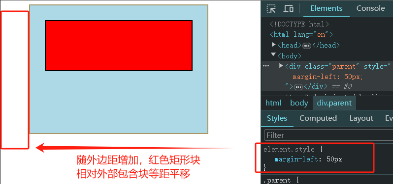
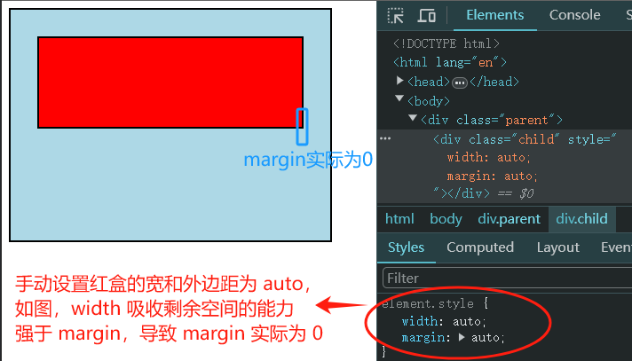
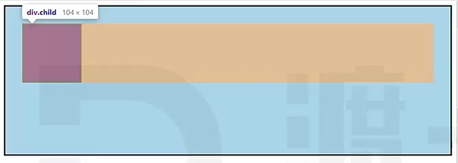
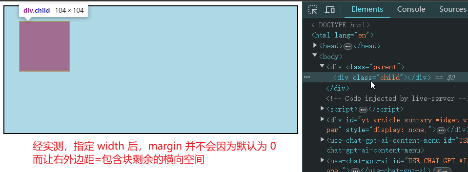
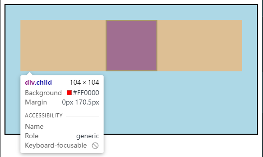
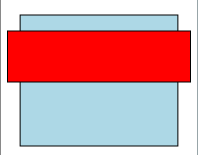

# Ch06L27 常规流

> MDN文档：[Normal Flow](https://developer.mozilla.org/en-US/docs/Learn/CSS/CSS_layout/Normal_Flow)

## 0 概述

盒模型：规定单个盒子的规则

视觉格式化模型（布局规则）：页面中的多个盒子排列规则

视觉格式化模型，大体上将页面中盒子的排列分为三种方式：

1. **常规流**（本节内容）
2. 浮动
3. 定位

CSS 最核心的知识点：

1. 属性值的计算过程（优先级、继承……）
2. 盒模型
3. **视觉可视化模型（布局规则）**（本节内容）

---


## 1 常规流布局

又称：常规流、文档流、普通文档流、常规文档流

所有元素，默认情况下，都属于常规流布局

> **总体规则：块盒独占一行，行盒水平依次排列**

包含块：即 `containing block`，每个盒子都有它的包含块。**包含块** 决定了盒子的排列区域。

绝大部分情况下，盒子的包含块，**为其父元素的内容盒**。

例如：红盒的包含块就是外层的蓝盒。蓝盒平移时，红盒相对与蓝盒静止：



代码如下：

```html
<style>
.parent {
  background-color: lightblue;
  width: 300px;
  height: 200px;
  border: 2px solid;
  padding: 30px;
}
.child {
  border: 2px solid;
  height: 100px;
  background-color: red;
}
</style>
<body>
    <div class="parent">
        <div class="child"></div>
    </div>
</body>
```


## 2 常规流布局规则之——块盒

（行盒的规则详见上一节）

### 2.1. 每个块盒的总宽度，必须刚好等于包含块的宽度

宽度的默认值是 `auto`

`margin` 的取值也可以是 `auto`，默认值 `0`

无论是宽还是外边距，这里的 `auto` 的含义都是：将剩余空间全部吸收掉

若同时为 `auto`：`width` 吸收能力 **强于** `margin`：



若宽度、边框、内边距、外边距计算后，仍然有剩余空间，该剩余空间被 `margin-right` 全部吸收。

视频中的效果：



经实测，Chrome 在渲染上和旧版有区别，右外边距的大小始终为 0，但剩余空间并未渲染为淡黄色，因此也无从知晓是否遵循【必须刚好等于包含块的宽度】。



在 **常规流** 中，块盒在其包含块中居中，可以定宽、然后左右 `margin` 设置为 `auto`。

```css
.parent {
  background-color: lightblue;
  height: 200px;
  border: 2px solid;
  padding: 30px;
}
.child {
  border: 2px solid;
  height: 100px;
  background-color: red;
  width: 100px; /* 定宽 */
  margin-left: auto;  /* 左外边距为 auto */
  margin-right: auto;  /* 右外边距为 auto */
}
```

实测效果：




> [!tip]
>
> 子元素溢出父元素的效果：
>
> ```css
> .parent {
>       background-color: lightblue;
>       height: 200px;
>       border: 2px solid;
>       padding: 30px;
>       margin: 30px;
> }
> .child {
>       border: 2px solid;
>       height: 100px;
>       background-color: red;
>       margin: 0 -57px; /* 溢出部分为 57 - 30 = 27px */
> }
> ```
>
> 效果：
>
> 


### 2.2. 每个块盒垂直方向上的 auto 值

- `height` 的值若为 `auto`， 则适应 **内容的** 高度。
- `margin` 的值若为 `auto`， 表示为 `0`


### 2.3. 百分比取值

`padding`、`width`、`margin` 可以取值为百分比

以上的 **所有百分比** 都相对于 **包含块的 *宽度***，与包含块的高无关。

垂直方向上，高度百分比的具体取值：

1. 包含块的高度取决于当前子元素的高度，设置百分比 **无效**（循环依赖）
2. 包含块的高度不取决于当前子元素的高度，百分比相对于 **父元素高度**


### 2.4. 上下外边距的合并

两个常规流块盒，上下外边距相邻，会进行合并（折叠，collapsed）。

两个外边距取最大值。
