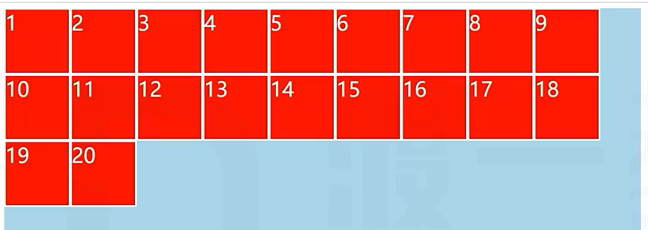
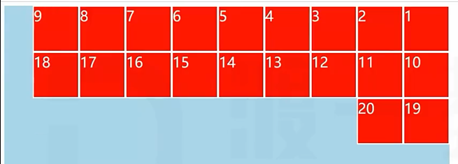
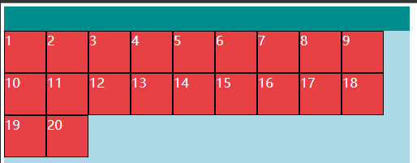
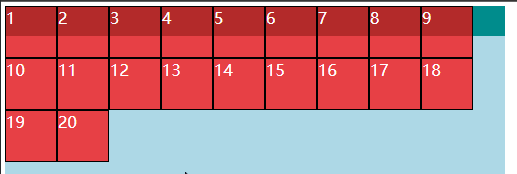
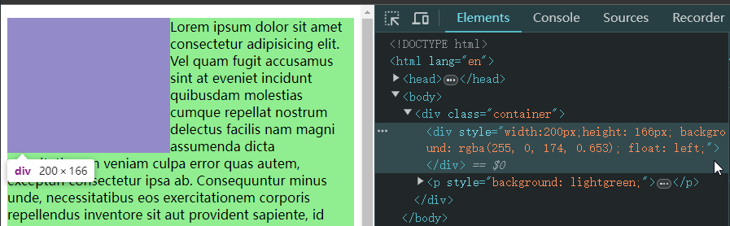

# Ch07L29 浮动

视觉格式化模型，大体上将页面中盒子的排列分为三种方式：

1. 常规流
2. **浮动**（本节内容）
3. 定位

---

## 1 应用场景

1. 文字环绕
2. 横向排列

## 2 浮动的基本特点

修改 `float` 属性值为：

- `left`：左浮动，元素靠上靠左
- `right`：右浮动，元素靠上靠右

默认值为 `none`

1. 当一个元素浮动后，元素必定为块盒(更改 `display` 属性为 `block`)
2. 浮动元素的包含块，和常规流一样，为 **父元素的内容盒**

## 3 盒子尺寸

1. 宽度为 `auto` 时，适应内容宽度
2. 高度为 `auto` 时，与常规流一致，适应内容的高度
3. `margin` 为 `auto`，为 `0`（而常规流是吸收剩余空间）
4. 边框、内边距、百分比设置与常规流一样

## 4 盒子排列

1. **左浮动** 的盒子 **靠上靠左** 排列

   

2. **右浮动** 的盒子 **靠上靠右** 排列

   

3. 浮动盒子在包含块中排列时，**会避开（前面的）常规流块盒**（常规盒+浮动盒子）

   

4. 浮动盒子后面的常规流块盒，在排列时 **无视（前面的）浮动盒子**（浮动盒子+常规盒子）

   

5. 行盒在排列时，会 **避开（环绕）浮动盒子**

   

6. 外边距合并不会发生

> [!important]
>
> **关于第 5 条的说明**
>
> 如果文字并没有在行盒中，浏览器会 **自动生成一个行盒** 包裹文字，该行盒叫做 **匿名行盒**。理解时可近似认为文字全部放到了一个匿名的 `span` 元素内。
>
> 文字会环绕（避开）紫色盒子排列，但是 `p` 元素在紫色盒子下方仍然占据空间，只是被【浮】在上方的紫色盒子遮住了。
>
> 根据第 4 条规则，`p` 元素在浮动盒子后面，布局时直接无视浮动盒子，跑到浮动元素的下方。

## 5 高度坍塌

高度坍塌的根源：常规流盒子的自动高度，在计算时，**不会考虑浮动盒子**

清除浮动，涉及 CSS 属性：`clear`

- 默认值：`none`
- `left`：清除左浮动，该元素必须出现在前面所有左浮动盒子的下方
- `right`：清除右浮动，该元素必须出现在前面所有右浮动盒子的下方
- `both`：清除左右浮动，该元素必须出现在前面所有浮动盒子的下方
