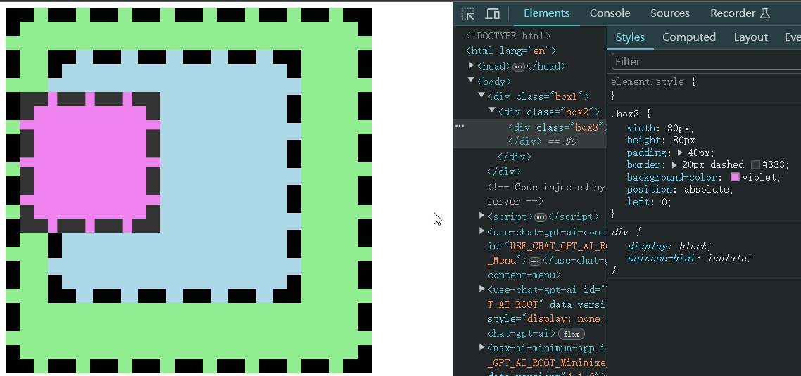

# Ch07L31 定位

## 0 概述

视觉格式化模型，大体上将页面中盒子的排列分为三种方式：

1. 常规流
2. 浮动：float
3. **定位：position**（本节内容）

定位：手动控制元素在 **包含块中的** 精准位置

涉及的 CSS 属性：`position`

---


## 1 position属性

- 默认值：`static`，静态定位（不定位）
- `relative`：相对定位
- `absolute`：绝对定位
- `fixed`：固定定位

> **定位元素**
>
> 一个元素，只要 `position` 的取值不是 `static`，认为该元素是一个 **定位元素**。

定位元素会脱离文档流（相对定位除外）

一个脱离了文档流的元素：

1. 文档流中的元素摆放时，会忽略脱离了文档流的元素
2. 文档流中元素计算自动高度时，会忽略脱离了文档流的元素


## 2 相对定位

不会导致元素脱离文档流，只是让元素在原来位置上进行偏移。

可以通过四个 CSS 属性对设置其位置：

- `left`
- `right`
- `top`
- `bottom`

盒子的偏移不会对其他盒子造成任何影响。


## 3 绝对定位

1. 宽高为 `auto`，适应内容
2. 包含块变化：找祖先中 **第一个定位元素**，该元素的 **填充盒**（`padding-box`）为其包含块。若找不到，则它的包含块为 **整个网页**（又叫 **初始化包含块**）

示例：

```css
.box1 {
    width: 400px;
    height: 400px;
    padding: 40px;
    border: 20px dashed #000;
    background-color: lightgreen;
    position: relative; /* 让最外层盒子为包含块 */
}

.box2 {
    width: 240px;
    height: 240px;
    padding: 40px;
    border: 20px dashed #000;
    background-color: lightblue;
}

.box3 {
    width: 80px;
    height: 80px;
    padding: 40px;
    border: 20px dashed #333;
    background-color: violet;
    position: absolute; /* 设置绝对定位 */
    left: 0;  /* 相对于包含块，左侧偏移量为0 */
}
/* HTML: 
<div class="box1">
  <div class="box2">
    <div class="box3"></div>
  </div>
</div>
*/
```

实测效果：包含块是外层最近的定位元素的 **边框盒**——



> [!tip]
>
> 对父级设置相对定位，起作用主要就是为子元素提供包含块的。


## 3 固定定位

其他情况和绝对定位完全一样。

包含块不同：固定为 **视口**（`view port`，浏览器的可视窗口）


## 4 定位下的居中

某个方向居中：

1. 定宽（高）
2. 将左右（上下）距离设置为0
3. 将左右（上下）`margin` 设置为 `auto`

绝对定位和固定定位中，`margin` 为 `auto` 时，会自动吸收剩余空间


## 5 多个定位元素重叠时

堆叠上下文（详见扩展课程）

设置 `z-index`，通常情况下，该值越大，越靠近用户

只有对 **定位元素** 设置 `z-index` 才有效。

`z-index` 可以是负数，如果是负数，则遇到常规流、浮动元素，则会被其覆盖（文字在上，圆环在下）

示例：奥运五环。


## 6 补充

- 绝对定位、固定定位元素一定是 **块盒**（例如：对 `span` 设置 `position`，其 `display` 自动变为 `block`）
- 绝对定位、固定定位元素一定不是浮动（例如：若 `float` 和 `position` 同时设置，则 `float` 自动变为 `none`，`position` 胜出）
- 没有外边距合并
