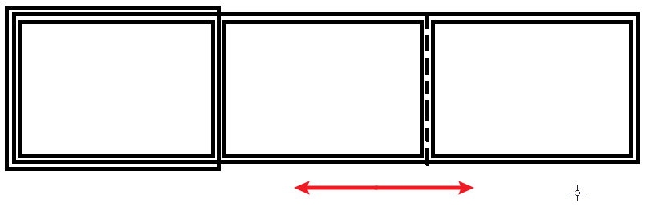

# Ch07L34 定位练习3-轮播图

## 1 HTML 总体思路

1. 一个最外层容器，用于展示一个图片；
2. 内嵌一个图片容器，用于横向存放所有图片；
3. 图片容器包含每一张图片，并用 `a` 元素包裹，实现跳转。
4. 后期切换时，只需变动 2 中图片容器的左外边距（`margin-left: 0 | -500px | -1000px`），即每次变动一张图片宽度。

如图所示：

## 2 其他注意事项

视频只对轮播图进行了大致模拟，一些细节留待进阶课程完成（渐变、字体图标等）

另外，视频在设计 HTML 结构时，对语义化的应用较少，比如图片和对应的文字描述，可以使用 `figure` + `figcaption`。（详见 [MDN 文档](https://developer.mozilla.org/en-US/docs/Web/HTML/Element/figure)）
