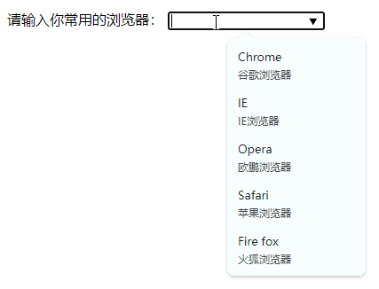
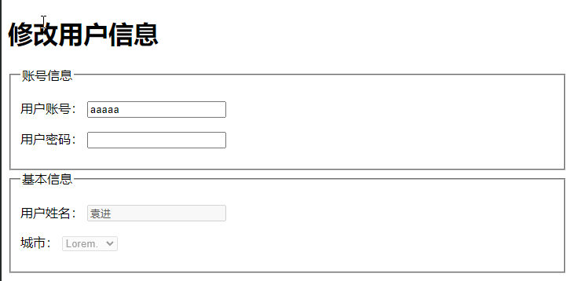

# Ch08L40 表单元素


涉及一系列元素，主要用于收集用户数据。

## 1 input 元素

输入框

- `type` 属性：输入框类型
  - `type="text"`：普通文本输入框
  - `type="password"`：密码框
  - `type="date"`：日期选择框，有兼容性问题
  - `type="search"`：搜索框，有兼容性问题
  - `type="number"`：数字输入框，通过 `min`、`max`、`step` 调节范围，注意返回的值都是文本型，不是数字型
  - `type="checkbox"`：多选框（默认选中，使用 `checked` 布尔属性）
  - `type="radio"`：单选框（默认选中，使用 `checked` 布尔属性）
  - （以下为不太常见的输入框类型）
  - `type="slider"`：滑块元素，用于设置一定范围内的值
  - `type="color"`：颜色选择器
  - `type="file"`：上传文件输入框（需配合JS、后端）

- `value` 属性：输入框的值，类型统一为 **字符串型**
- `placeholder` 属性：显示提示的文本，文本框没有内容时显示

`input` 元素还可以制作按钮：

- `type="reset"`：重置按钮
- `type="button"`：普通按钮
- `type="submit"`：提交按钮


## 2 select 元素

下拉列表选择框

通常和 `option` 选项元素配合使用

默认选中某一项，使用 `selected` 布尔属性。

可对选项进行分组：

```html
<p>
    请选择你最喜欢的主播：
    <select>
        <optgroup label="才艺表演">
            <option>冯提莫</option>
        </optgroup>
        <optgroup label="游戏主播">
            <option>WETed</option>
            <option>infi</option>
            <option>th000</option>
        </optgroup>
    </select>
</p>
```


## 3 textarea 元素

文本域，多行文本框，属于 **可替换元素**

会保留空格。

虽然提供了 `cols` 和 `rows` 属性设置宽高，但不推荐使用。推荐通过 CSS 样式设置（专门负责页面呈现）


## 4 按钮元素

`button`：HTML 4.01 出现，已经几乎不存在兼容性问题了。

`type` 属性：`reset`、`submit`、`button`，默认值 `submit`

推荐使用 button 而不是 input 元素，因为前者更灵活，扩展性更好：

```html
<!-- input vs button -->
<input type="image" src="hashiqi.jpg">
<button>
    
    <p>Lorem ipsum dolor sit.</p>
</button>
```


## 5 表单状态

`readonly` 属性：布尔属性，是否只读，不会改变表单显示样式

`disabled` 属性：布尔属性，是否禁用，会改变表单显示样式


## 6 配合表单元素的其他元素

### 6.1. label

普通元素，通常配合单选和多选框使用

- 显式关联

可以通过 `for` 属性，让 `label` 元素关联某一个表单元素，`for` 属性书写表单元素 `id` 的值

- 隐式关联

`input` 直接放到 `label` 内部


### 6.2. datalist

数据列表

该元素本身不会显示到页面，通常用于和普通文本框配合

输入框通过 `list` 属性关联 `datalist` 的 `id`：

```html
<p>
    请输入你常用的浏览器：
    <input list="userAgent" type="text">
</p>
<datalist id="userAgent">
    <option value="Chrome">谷歌浏览器</option>
    <option value="IE">IE浏览器</option>
    <option value="Opera">欧鹏浏览器</option>
    <option value="Safari">苹果浏览器</option>
    <option value="Fire fox">火狐浏览器</option>
</datalist>
```

效果：（支持模糊匹配，`value` 和 `label` 均可匹配）




### 6.3. form 元素

通常，会将整个表单元素，放置 `form` 元素的内部，作用是当提交表单时，会将`form` 元素内部的表单内容以合适的方式提交到服务器。

`form` 元素对开发静态页面没有什么意义。


### 6.4. fieldset 元素

表单分组，从语义上进行规范，常搭配 `legend` 标识分组信息：

```html
<h1>修改用户信息</h1>
<fieldset>
    <legend>账号信息</legend>
    <p>
        用户账号：
        <input type="text" value="aaaaa" readonly>
    </p>
    <p>
        用户密码：
        <input type="password">
    </p>
</fieldset>

<fieldset>
    <legend>基本信息</legend>
    <p>
        用户姓名：
        <input disabled value="袁进" type="text">
    </p>
    <p>
        城市：
        <select disabled name="" id="">
            <option value="">Lorem.</option>
            <option value="">Vel!</option>
            <option value="">Dolore?</option>
        </select>
    </p>
</fieldset>
```

效果：


