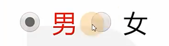
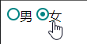

# Ch08L41 美化表单元素


## 1 新的伪类

1. `focus`：元素聚焦时的样式

`tabindex`：手动设置焦点顺序

重置 Chrome 自带的输入框【获得焦点】样式：（已过时）

```css
input:focus {
    outline: none;
    outline-offset: 0; /* -2px by default */
}
```

> [!important]
>
> 与视频不同的是，最新版的 `Chrome`（v124.0.6367.119）对 `input` 文本框得焦点的默认样式，已经从 `:focus` 变更为更加注重可访问性的 `:focus-visible` 上了：
>
> ```css
> input:focus-visible {  /* user agent stylesheet */
>   outline-offset: 0px;
> }
> :focus-visible {
>   outline: -webkit-focus-ring-color auto 1px;
> }
> ```
>
> `:focus-visible` 与 `:focus` 的区别与联系：
>
> - `:focus` 是无条件的（unconditional，对于可聚焦元素）
> * `:focus-visible` 是有条件的（conditional）——由浏览器决定是否显示焦点。
>
> 例如，在 Chrome 中，当使用鼠标时，它会在 **文本字段** 上显示焦点，但不会在 **按钮** 上显示焦点。 它 **仅在使用键盘时** 显示在按钮上。
>
> 来源：[CodePen：`:focus` vs. `:focus-visible`](https://codepen.io/michai/pen/eYgLPBG) 
>
> 更多参考：
>
> - [Focus or focus visible? A guide to make your focus state accessible](https://mayashavin.com/articles/focus-vs-focus-visible-for-accessibility)
> - [码农之家：身处“前端已死”年代，或许你更应该关注 a11y](https://www.pipipi.net/21053.html)


2. `checked`：单选或多选框被选中的样式

设置单选框或复选框下一个标签里的样式：

```css
input:checked+label {
    background-color: red;
}
```




## 2 常见用法

1. 重置表单元素样式

2. 设置 `textarea` 是否允许调整尺寸
   1. `resize` 属性：
      1. `both`：默认值，两个方向都可以调整尺寸
      2. `none`：不能调整尺寸
      3. `horizontal`: 水平方向可以调整尺寸
      4. `vertical`：垂直方向可以调整尺寸


3. 文本框边缘到内容的距离
   1. `padding`：整体缩进

   2. `text-indent`：首行缩进

4. 控制单选和多选的样式（重点）

思路：

1. 重新设计单选或多选的样式
2. 然后放到原始元素后面，通过伪类进行关联
3. 最后隐藏原始元素

实测自定义单选按钮组：

```css
body { --mars: #008484; }
label[for] { cursor: pointer; }
/* 1. define new radio */
.radio {
  display: inline-block;
  width: 12px;
  height: 12px;
  border-radius: 50%;
  border: 2px solid var(--mars);
  cursor: pointer;
}
/* 2. define new checked */
input:checked + .radio::after {
  content: "";
  display: block;
  width: 6px;
  height: 6px;
  border-radius: 50%;
  background-color: var(--mars);
  position: relative;
  top: 3px;
  left: 3px;
}
/* 3. hide original radio */
input[type="radio"] {
  display: none;
}
/* HTML
<label for="man">
    <input type="radio" name="gender" id="man">
    <span class="radio"></span>男
</label>
<label for="woman">
    <input type="radio" name="gender" id="woman">
    <span class="radio"></span>女
</label>
*/
```

效果：


