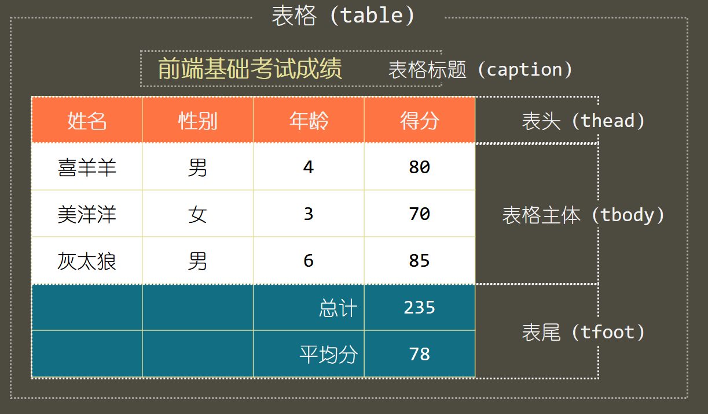
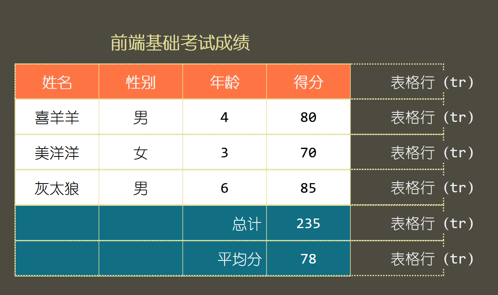
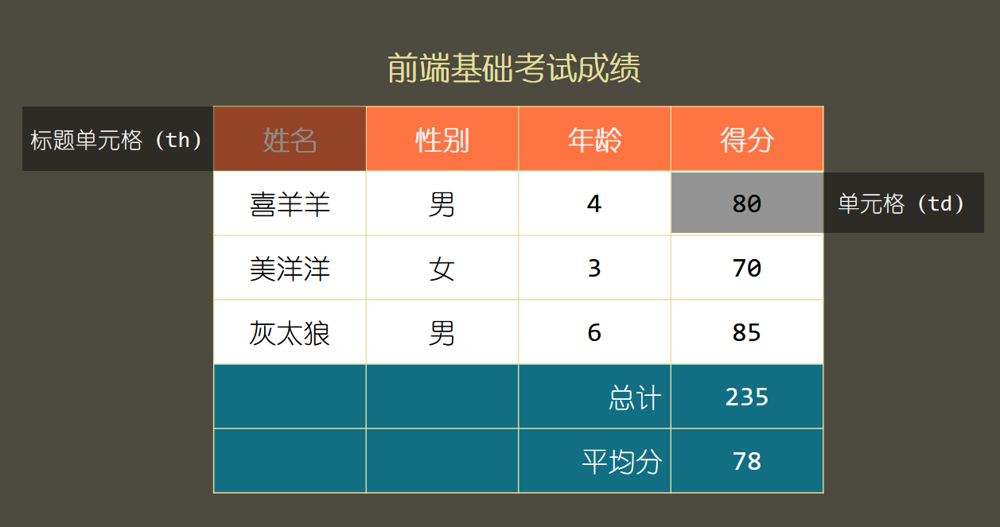

# Ch08L43 表格元素_补


## 1 概述

在 CSS 技术出现之前，网页通常使用 **表格** 进行布局。

后台管理系统中可能会使用表格。

前台：面向用户

后台：面向管理员。对界面要求不高，对功能性要求高。

为什么表格不再适用于网页布局？

因为渲染速度过慢，必须全部解析完才能渲染。


## 2 表格相关术语

基本结构1：




基础结构2：




基础结构3：




## 3 基本操作

表格行中的单元格元素，既可以用 `th`，也可以用 `td`，只是语义不同，样式可以根据需求定制。

表格中的单元格边框默认是分离的，可以用 `table` 元素的 `border-collapse` 属性手动更改：

- `separate`：边框分离（默认值）。
- `collapse`：边框折叠，使各单元格之间没有间隙。

跨行：`rowspan`
跨列：`colspan`

设置隔行填充背景色：

```css
tbody tr:nth-child(odd) {
    background: rgb(221, 221, 221);
}
```


鼠标移入表格，鼠标所在的当前行背景变色：

```css
tbody tr:hover {
    background: #ccc;
}
```


选中第一列单元格：

```css
tbody td:first-child {
    color: chocolate;
}
```

