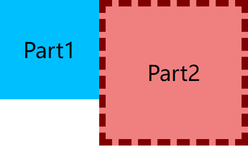

# Ch09L47 块级格式化上下文


## 1 简介

全称 **B**lock **F**ormatting **C**ontext，简称 **BFC**。它是**一块独立的渲染区域**。BFC 规定了在该区域中，**常规流** <kbd>块盒</kbd> 的布局。

常规流块盒的布局特点：

- 水平方向：必须撑满包含块
- 垂直方向：依次摆放
- 若外边距无缝相邻（无 `border`、`padding`），则发生外边距合并（详见 *Ch6L27-常规流*）
- 其自动高度和摆放位置，会无视浮动元素及定位元素（详见 *Ch7L29-浮动*）


## 2 BFC 渲染区域

BFC 的渲染区域，由某个 HTML 元素创建。

会在元素内部创建 BFC 区域的元素主要包括三大类：

1. 根元素：即 `html` 元素，覆盖网页中的所有元素；
2. **浮动** 和 **绝对、固定定位** 元素；
3. `overflow` 的值不为默认值 `visible` 的块盒。

如图所示：


> [!tip]
>
> *CSS in Depth* 第一版对创建 BFC 的方法进行了归纳，包括四种情况：
>
> 1. `float`：值为 `left` | `right`（只要不是 `none`）；
> 2. `overflow`：值为 `hidden` | `auto` | `scroll`（只要不是默认值 `visible`）；
> 3. `position`：值为 `absolute` | `fixed`；
> 4. `display`：`inline-block` | `table-cell` | `table-caption` | `flex` | `inline-flex` | `grid` | `inline-grid`（即【块级容器】（block containers））
>
> （详见 P104，第 4.4.1 小节）


## 3 BFC 的特点

两个大原则：

- 不同的 BFC 区域，在渲染时互不干扰
- 创建 BFC 的元素，隔绝了其内外部的联系，内部渲染不会影响到外部

具体规则：

- 创建 BFC 的元素，它的自动高度 **需要考虑浮动元素**
- 创建 BFC 的元素，它的 **边框盒不会与浮动元素重叠**
- 创建 BFC 的元素，不会和它的子元素发生外边距合并（塌陷）


### 3.1. 自动高度须考虑浮动元素

容器高度设为自动后，BFC 的高度考虑了浮动元素：


具体样式详见【[附录1](#app1 "按住 Ctrl 单击跳转")】。<a id="app1_back"></a>


### 3.2. 边框盒不与浮动元素重叠

如图，蓝盒不会进入红盒的 **边框盒**：



样式详见【[附录2](#app2 "按住 Ctrl 单击跳转")】。 <a id="app2_back"></a>


若要在两者间增加间隙，与常规流类似，应该设置浮动元素，而不是 BFC 元素（如下图所示）：


### 3.3. 不与子元素发生边距合并

示例：设置 BFC 前内外 margin 发生合并：

将容器改为 BFC 后（恢复 L7 注释内容），外边距塌陷问题消失：

|  |  |
| :----------------------------------------------------------: | :----------------------------------------------------------: |
|                            设置前                            |                            设置后                            |

具体样式详见【[附录3](#app3 "按住 Ctrl 单击跳转")】。 <a id="app3_back"></a>

> [!tip]
>
> 该规则的另一种等效表述：处在不同 BFC 中的元素，其外边距不会发生合并（塌陷）。


### 3.4. 辨析：绝对定位 vs 外边距合并

根据规则三，内嵌元素的外边距合并问题可以通过设置容器元素为 BFC 解决。

这里内嵌的子元素，要么是以 **常规流** 形式出现，要么是以 **浮动流** 形式出现，**唯独不能是绝对或固定定位** 的形式出现，后者的父元素是无法自动计算高度的（因为彻底脱离了文档流），例如：（代码详见【[附录4](#app4 "按住 Ctrl 单击跳转")】）<a name="app4_back"></a>


如图所示——

- 父容器 `.container` 并没有为绝对定位的子元素 `.child` 自动计算高度（高度为 0，仅渲染了第 4 行的上边距 `50px`）；
- 由于父容器使用了 **左浮动**（L5）成为了 BFC，因此子容器的上外边距依然没有与父容器发生合并（或坍塌、塌陷）；
- 可见，BFC 的第三条渲染规则仍然成立。


---

## 4 附录（示例代码）

### 附录1 示例代码：自动高度须考虑浮动元素代码 <a id="app1"></a>

```css
.container {
    width: 600px;
    background-color: lightblue;
    overflow: hidden; /* or:
    position: absolute | fixed; (but not relative)
    float: left | right;
    */
}
.item {
    width: 100px;
    height: 100px;
    margin: 10px;
    background-color: lightcoral;
    float: left;
    color: ivory;
    text-align: center;
    line-height: 100px;
    font-size: 2em;
}
/* HTML: .container>.item*7{$} */
```

（[返回](#app1_back "按住 Ctrl 单击返回")）

---


### 附录2  示例代码：边框盒不与浮动元素重叠代码 <a id="app2"></a>

```css
* { margin: 0; padding: 0; }
div { font-size: 4em; text-align: center; text-transform: capitalize; }
.part1 {
    line-height: 300px;
    width: 300px;
    height: 300px;
    background-color: deepskyblue;
    float: left;  /* 1st BFC */
}
.part2 {
    line-height: 400px;
    height: 400px;
    background-color: lightcoral;
    border: 20px dashed maroon;
    overflow: hidden; /* 2nd BFC */
}
/* HTML: .part$*2{part$} */
```

（[返回](#app2_back "按住 Ctrl 单击返回")）

---


### 附录3 示例代码： 不与子元素发生边距合并<a id="app3"></a>

```css
.container {
    width: 200px;
    height: 200px;
    background-color: lightblue;
    margin-top: 50px;
    /* toggle BFC */
    /* overflow: hidden; */
}
.child {
    width: 100px;
    height: 100px;
    background-color: lightcoral;
    margin: 50px auto 0;
}
/*HTML: .container>.child */
```

（[返回](#app3_back "按住 Ctrl 单击返回")）

---


### 附录4 示例代码：绝对定位 vs 外边距合并<a id="app4"></a>

```css
.container {
    width: 200px;
    background-color: lightblue;
    margin-top: 50px;
    float: left;
    position: relative;
}
.child {
    width: 100px;
    height: 100px;
    background-color: lightcoral;
    margin: 50px auto 0;
    position: absolute;
    top: 0;
    left: 0;
}
/*HTML: .container>.child */
```

（[返回](#app4_back "按住 Ctrl 单击返回")）
