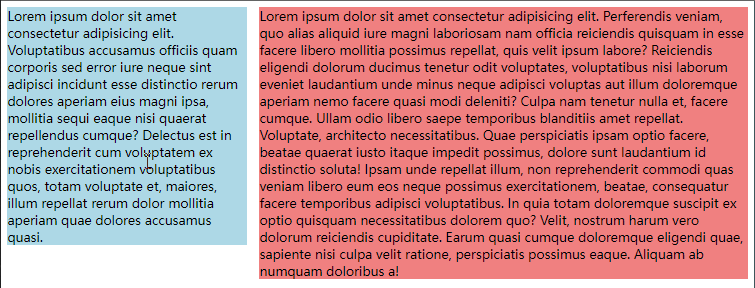
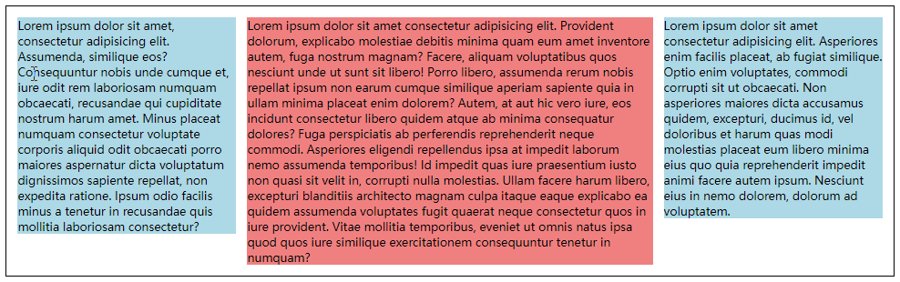
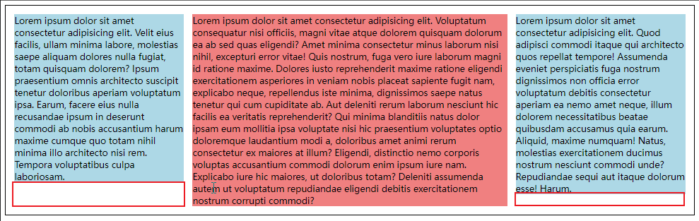
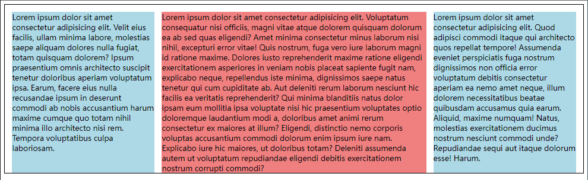
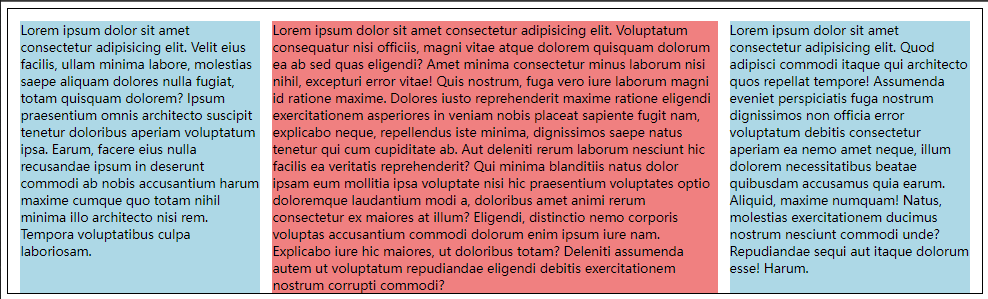
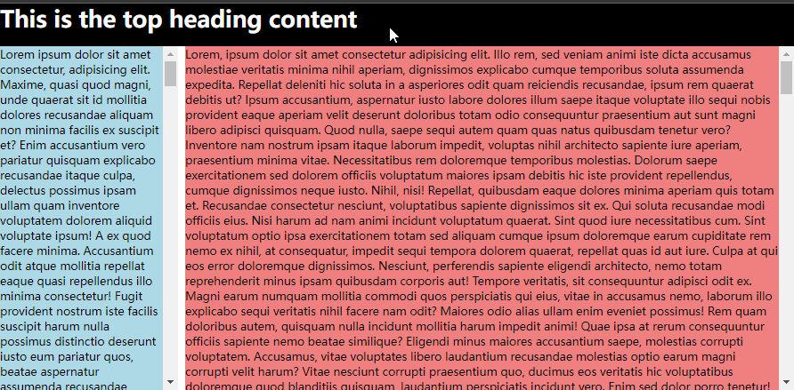

# Ch09L48 布局


## 1 多栏布局

### 1.1 两栏布局

经典：侧边栏定宽+浮动、正文区自动计算宽度：



代码详见【[附录1](#code1 "经典两栏布局")】。<a id="code1_back"></a>


### 1.2 三栏布局

与两栏类似，三栏布局即两边的侧边栏一左一右浮动、定宽；同时中间正文区设置 BFC：



代码详见【[附录2-1](#code2-1 "三栏布局")】。<a id="code2-1_back"></a>

> [!warning]
>
> 如果正文区是常规流块盒，则会无视两边的浮动元素，影响后续元素的布局：
>
> 
>
> 可以看到，正文区溢出并蔓延至侧边栏下方（代码详见【[附录2-2](#code2-2 "正文区是常规流块盒")】）<a id="code2-2_back"></a>


## 2 等高问题

等高问题如下图所示：



解决该问题的常见处理方法有三类：

1. CSS3 的弹性盒（未涉及）
2. JavaScript 控制（未涉及）
3. **伪等高（本节演示）**

所谓 **伪等高**，就是利用负 `margin` 让背景覆盖范围人为超过内容高度的策略。

具体实现步骤：

1. 先给侧边栏一个极大高度值；
2. 再用负的 `margin` 修正到一个较小范围（如 `15px`）；
3. 最后在最外层容器上隐藏溢出部分；

这样，当侧边栏被内容撑开后，背景区就能和正文区的高度同步缩放：



代码详见【[附录3](#code3 "伪等高策略")】<a id="code3_back"></a>


## 3 关于元素的书写顺序问题

上述布局方式对 SEO 不友好（侧边栏为了浮动效果而优先渲染）

解决方案：正文区靠前放置，同时为侧边栏预留出外边距；侧边栏做绝对定位。

效果和上面一样，只是实现思路完全不同：（代码详见【[附录4](#code4 "考虑 SEO 的三栏布局")】<a id="code4_back"></a>）



不足：**外层容器无法感知侧边栏的真实高度**（因为绝对定位完全脱离了常规流）


## 4 后台页面的布局

后台静态页由于不考虑 SEO，因此侧边栏写在前面也可以。

简易后台页包括：

1. 顶部标题栏：绝对定位
2. 左侧边栏：定宽，支持上下滚动条
3. 正文区：宽度不固定，支持上下滚动条

实测效果：（代码详见【[附录5](#code5 "简易后台页")】）<a id="code5_back"></a>




## 附录（示例代码）

### 附录1：示例：经典两栏布局 <a id="code1"></a>

```css
aside {
    float: left;
    width: 300px;
    background-color: lightblue;
    margin-right: 15px;
}
main {
    background-color: lightcoral;
    overflow: hidden;
}
/* HTML: (aside>lorem60)+main>lorem150 */
```

（[返回](#code1_back "按住 Ctrl 单击返回")）

---


### 附录2：三栏布局示例代码

#### 附录2-1：正文区使用 BFC<a id="code2-1"></a>

```css
.container {
    border: 1px solid;
    padding: 15px;
}
aside {
    width: 300px;
    background-color: lightblue;
}
main {
    background-color: lightcoral;
    overflow: hidden;
}
.clearfix::after {
    content: '';
    display: block;
    clear: both;
}
.left {
    float: left;
    margin-right: 15px;
}
.right {
    float: right;
    margin-left: 15px;
}
/* HTML: .container.clearfix>(aside.left>lorem60)+(aside.right>lorem60)+main>lorem140 */
```

（[返回](#code2-1_back "按住 Ctrl 单击返回")）


#### 附录2-2：正文区不使用 BFC <a id="code2-2"></a>

（略，代码同 **附录2-1**，只需禁用 L11：`overflow: hidden;`）

（[返回](#code2-2_back "按住 Ctrl 单击返回")）

---


### 附录3：示例代码：伪等高策略 <a id="code3"></a>

```css
.container {
    border: 1px solid;
    padding: 15px 15px 0 15px; /* fake same-height workaround */
    overflow: hidden; /* fake same-height workaround */
}
aside {
    width: 300px;
    background-color: lightblue;
    height: 20000px; /* fake same-height workaround */
    margin-bottom: -19990px; /* fake same-height workaround */
}
main {
    background-color: lightcoral;
    overflow: hidden;
}
.clearfix::after {
    content: '';
    display: block;
    clear: both;
}
.left {
    float: left;
    margin-right: 15px;
}
.right {
    float: right;
    margin-left: 15px;
}
/* HTML: .container.clearfix>(aside.left>lorem60)+(aside.right>lorem60)+main>lorem140 */
```

注意：L3 对容器的底部内边距做了清除，以保证高度一致。同时也从侧面说明该方案的局限性：一旦正文区对底边有其他样式设计，则无法同步到侧边栏上。

（[返回](#code3_back "按住 Ctrl 单击返回")）

---


### 附录4：示例：考虑 SEO 的三栏布局 <a id="code4"></a>

```css
.container {
    border: 1px solid;
    padding: 15px 15px 0 15px;
    overflow: hidden;
    position: relative;
}
aside {
    width: 300px;
    background-color: lightblue;
    height: 20000px;
    margin-bottom: -19990px;
}
main {
    background-color: lightcoral;
    margin: 0 315px;
}
.left {
    position: absolute;
    top: 15px;
    left: 15px;
}
.right {
    position: absolute;
    top: 15px;
    right: 15px;
}
/* HTML: .container.clearfix>(main>lorem140)+(aside.left>lorem60)+aside.right>lorem60 */
```

注意：L15 考虑了最终的边距间隙，因此要多 `15px`。

（[返回](#code4_back "按住 Ctrl 单击返回")）

---


### 附录5：示例：简易后台页布局<a id="code5"></a>

CSS：

```css
body, h1 { margin: 0; }
.app {
    position: fixed;
    width: 100%;
    height: 100%;
}
header {
    background-color: #000;
    color: #fff;
    position: absolute;
    top: 0;
    left: 0;
    width: 100%;
    height: 60px;
}
.container {
    padding-top: 60px;
    height: 100%;
    box-sizing: border-box;
}
.container aside {
    background-color: lightblue;
    float: left;
    margin-right: 10px;
    width: 250px;
    height: 100%;
    box-sizing: border-box;
    overflow: auto;
}
.container main {
    background-color: lightcoral;
    height: 100%;
    box-sizing: border-box;
    overflow: auto;
}
```

HTML：

```html
<body>
    <div class="app">
        <header>
            <h1>This is the top heading content</h1>
        </header>
        <div class="container">
            <aside>Lorem500</aside>
            <main>Lorem1500</main>
        </div>
    </div>
</body>
```

（[返回](#code5_back "按住 Ctrl 单击返回")）
