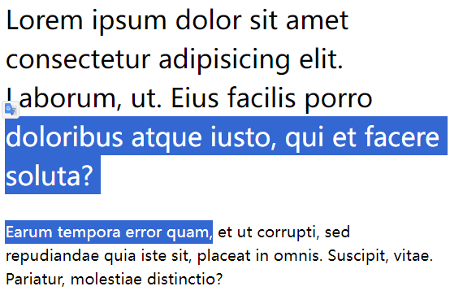

# Ch09L50 扩_行高的取值

## 1 原理

`line-height` 的值类型：

1. `px`：像素值

2. `3`：无单位的数字

3. `em`：相对单位

4. `%`：百分比

本节主要讲解后面三个的区别：

- 使用 `em` 或 **百分比**：先计算像素值，再继承给子元素；
- 使用 **数字**：先继承给子元素，再计算像素值；（推荐）


## 2 实测

> **需求描述**
>
> 设置行高为字体大小的 1.5 倍。

测试1：分别设置行高，一切正常：

```css
.p1 {
    line-height: 1.5em;
    font-size: 40px;
}
.p2 {
    line-height: 1.5em;
    font-size: 24px;
}
/* HTML: .container>p.p$*2>lorem20 */
```



测试2：行高放到容器元素，渲染异常：

```css
.container {
    line-height: 1.5em;
}
.p1 {
    font-size: 40px;
}
.p2 {
    font-size: 24px;
}
/* HTML: .container>p.p$*2>lorem20 */
```


测试3：使用纯数字，恢复正常：

```css
.container {
    line-height: 1.5;
}
.p1 {
    font-size: 40px;
}
.p2 {
    font-size: 24px;
}
/* HTML: .container>p.p$*2>lorem20 */
```


