# Ch09L51 扩_body的背景


## 问题1：有背景但高度为 0

按惯例，背景填充的默认区域是元素的 **边框盒（border-box）**，但对 `body` 无效[^1]：<a id="app1_back"></a>

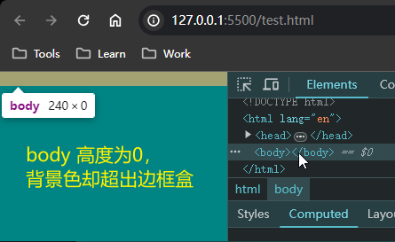

而且即便给定宽高，也同样不适用。例如：令 `body` 的宽高都是 `100px` [^2]：<a id="app2_back"></a>

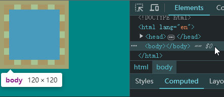

但是，只要设置 `html` 元素的背景，`body` 立即恢复正常 [^3]：<a id="app3_back"></a>

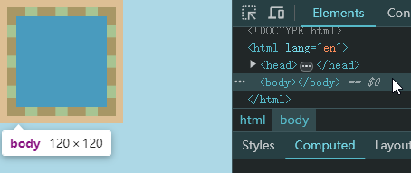

但此时 `html` 元素的高度又不正常了：

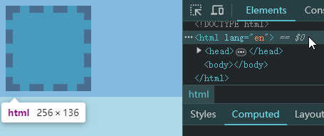


## 2 问题成因

导致上述问题的根本原因，在于 **画布（canvas）**。这里的画布，并不是 html5 中的 `canvas` 元素；这里的画布，就是一块区域，专门用于渲染背景。

该画布的特点：

1. 最小宽度为 **视口宽度**，上不封顶；
2. 最小高度为 **视口高度**，上不封顶；

而当给 `html` 元素设置背景时，**HTML 的背景** 就是 <u>***整个画布区域***</u>

而当给 `body` 元素设置背景时：

- 如果 `html` 元素有背景，`body` 元素正常（背景覆盖 **边框盒**）；
- 如果 `html` 元素无背景，`body` 的背景覆盖 **整个画布**；

这样规定，可能也是为了方便在 `body` 无内容时让背景样式生效。

不仅是单色背景如此，`body` 背景为某个图片时，上述规则依然生效。例如，不设置 `html`、只设置 `body` 背景图片，`body` 接管背景画布：

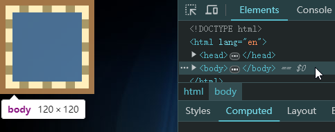

但追加 `html` 样式后，`html` 接管背景画布：

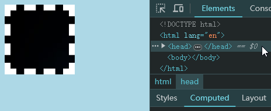


## 3 问题2：关于背景画布的宽高参照系

本节考察背景画布的 `background-size` 属性。

1. 背景图的宽度百分比，是 **相对视口而言** 的 [^4]：<a id="app4_back"></a>

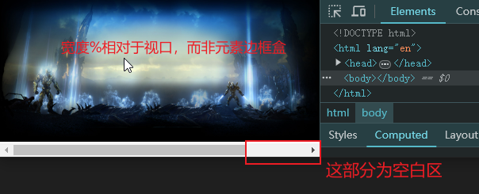

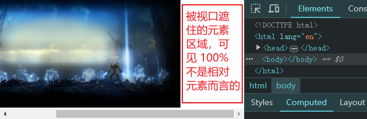

2. 背景图的高度百分比，是相对网页高度（即 `html` 元素高度）而言的 [^5]：<a id="app5_back"></a>

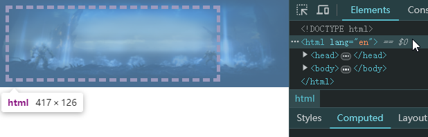

此时 `body` 的盒模型尺寸如下图所示：

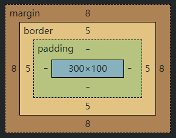

也说明此时 `html` 的高，就是 `body` 的实际高度（`126 = 100 + 5 × 2 + 8 × 2`）。


## 4 问题3：关于背景画布的位置参照系

本节考察背景画布的 `background-position` 属性。

1. 背景图的 **横向位置** 百分比、预设值：相对于视口 [^6]：<a id="app6_back"></a>

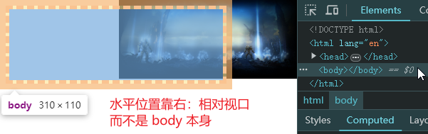

2. 背景图的 **纵向位置** 百分比、预设值：相对于网页高度（即 `html` 元素）[^7]：<a id="app7_back"></a>

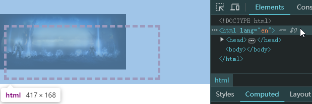

如图所示，设置 `body` 背景图垂直居中，相对的是 **`html` 的高度的正中**，而不是 `body` 元素本身，也不是视口的高度。


## 5 小结

- 为了方便 `body` 元素在无内容时也能全屏渲染指定背景，HTML 引入了类似 *背景画布* 的概念。
- 背景画布不同于 HTML5 的 `canvas` 元素；它就是一个用于 `body` 或 `html` 渲染背景的特殊区域。特点是：**最小宽高为当前视口的宽高，上不封顶**；
- 当设置 `html` 的背景时，`html` 接管该画布；
- 当设置 `body` 的背景时：
  - 若 `html` 有背景，则 `html` 接管该画布，body 与其他元素无异；
  - 若 `html` 无背景，则 `body` 接管该画布；
- 背景画布的尺寸参考系有两个：
  - 相对于视口：适用于 `background-size-x` 和 `background-position-x` 为百分比时的情况；
  - 相对于 `html` 元素：适用于 `background-size-y` 和 `background-position-y` 为百分比时的情况；

---

## 附录

### 附录1 示例：有背景但高度为0 <a id="app1"></a>

```css
body { background: #008484; }
```

（[返回](#app1_back "按住 Ctrl 单击返回")）


### 附录2 示例：定宽定高依然无效<a id="app2"></a>

```css
body {
    background-color: #008484;
    width: 100px;
    height: 100px;
    border: 10px dashed;
}
```

注：L5 为辅助边框，用以说明此时 `body` 的背景依旧超出了其边框盒范围。

（[返回](#app2_back "按住 Ctrl 单击返回")）


### 附录3 示例：设置 html 后 body 正常<a id="app3"></a>

```css
html {
    background-color: lightblue;
}
body {
    background-color: #008484;
    width: 100px;
    height: 100px;
    border: 10px dashed;
}
```

（[返回](#app3_back "按住 Ctrl 单击返回")）


### 附录4 示例：背景画布的百分比宽度是相对视口而言的 <a id="app4"></a>

```css
body {
    background: url(main_bg.jpg) no-repeat;
    height: 100px;
    /* assign the width of background canvas to 100% */
    background-size: 100%; 
    /* enlarge width to go beyond view port */
    width: 500px; 
}
```

> [!note]
>
> 其他元素的背景图宽度，如果是百分比，则参照系是该元素本身。
>
> 但 body 与 html 的背景画布例外，宽度为百分数时，参照系是 **当前视口的宽度**。

（[返回](#app4_back "按住 Ctrl 单击返回")）


### 附录5 示例：背景画布的百分比高度是相对于 html 元素而言的 <a id="app5"></a>

```css
body {
    background: url(main_bg.jpg) no-repeat;
    height: 100px;
    /* assign the width & height of background canvas to 100% */
    background-size: 100% 100%;
    /* narrow the width to be less than view port */
    width: 300px;
    border: 5px dashed lightcoral
}
```

（[返回](#app5_back "按住 Ctrl 单击返回")）


### 附录6 示例：背景画布的水平位置是相对视口而言的 <a id="app6"></a>

```css
body {
    height: 100px;
    width: 300px;
    border: 5px dashed lightcoral;
    background: url(main_bg.jpg) no-repeat;
    background-size: 60%;
    background-position-x: right;
}
```

（[返回](#app6_back "按住 Ctrl 单击返回")）


### 附录7 示例：纵向位置百分比的参照系是 html 元素而非 body 或视口 <a id="app7"></a>

```css
body {
    height: 100px;
    width: 300px;
    border: 5px dashed lightcoral;
    /* increase top margin to highlight the feature */
    margin-top: 50px;
    background: url(main_bg.jpg) no-repeat;
    background-size: 60%;
    background-position-x: left;
    /* center the image vertically */
    background-position-y: center; 
}
```

（[返回](#app7_back "按住 Ctrl 单击返回")）


---


[^1]: 样式代码详见【[附录1](#app1)】
[^2]: 样式代码详见【[附录2](#app2)】
[^3]: 样式代码详见【[附录3](#app3)】
[^4]: 样式代码详见【[附录4](#app4)】
[^5]: 样式代码详见【[附录5](#app5)】
[^6]: 样式代码详见【[附录6](#app6)】
[^7]: 样式代码详见【[附录7](#app7)】
