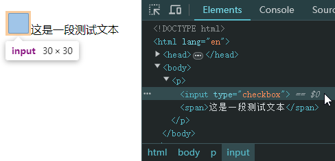

# Ch09L52 行盒的垂直对齐

## 1 多个行盒垂直方向上的对齐

方法：给没有对齐的行盒元素上设置 `vertical-align`（`center` 为垂直居中）。

 `vertical-align` 的值类型有两种：

- 数值或百分比（参考系详见下一小节：参考线-深入理解字体）；
- 预设值：`top`、`middle`、`bottom`……（如下图所示）


例如：

```css
input[type="checkbox"]{
    width: 30px;
    height: 30px;
}
/* HTML: p>input:checkbox+span{这是一段测试文本} */
```

居中前：



居中后（多选框样式加上 `vertical-align: middle;`）：


## 2 图片的底部白边

问题描述：当图片的父元素是一个块盒、且块盒高度自动时，图片底部和父元素底边之间往往会出现一段空白：

```css
div {
    border: 2px solid;
}
/* HTML:
<body>
    <div>
        
    </div>
</body>*/
```


而且字体越大，白边越多（原因详见下一节）。

解决方法：

1. 设置父元素的字体大小为 0（有副作用，内部文字手动设置 `em` 大小后并不生效）
2. 将图片设置为块盒（`display: block;`）
