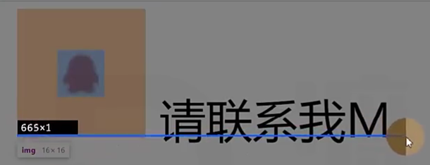
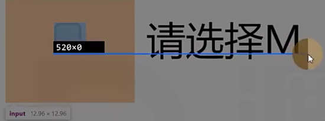
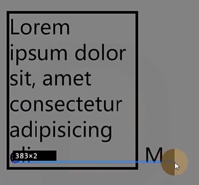

# Ch09L53 扩_参考线-深入理解字体

本节深入探讨 `font-size`、`line-height`、`vertical-align`、`font-family` 的相关知识。

## 1 文字

文字是通过一些文字制作软件制作的，比如 `Fontforge`

制作文字时，会有几根参考线，不同的文字类型，参考线不一样。同一种文字类型，参考线一致。

## 2 设置 font-size 的本质

字体大小，设置的是 **文字的相对大小**

常见的文字相对大小：1000、2048、1024

文字顶线到底线的距离，是文字的实际大小（`content-area`，内容区）

行盒的背景，覆盖 `content-area`

## 3 行高

顶线向上延申的空间（上边界称 `top`），和底线向下延申的空间（下边界称 `bottom`），两个空间相等，该空间叫做 `gap`（空隙，又叫 `line gap`）

`gap` 默认情况下，由 **字体设计者决定**

`top` 到 `botoom`（看ppt图），叫做 `virtual-area`（虚拟区）

设置 **行高**，本质就是 **virtual-area**

`line-height`：默认值 `normal`，表示使用文字默认的 `gap`

> [!caution]
>
> 文字一定出现一行的最中间。（:x: 错误）
> `content-area` 一定出现在 `virtual-area` 的中间（:heavy_check_mark: 正确 ）
>
> 结论：不要轻易将行高赋值为 `1`。

## 4 vertical-align

决定参考线的三个属性：`font-size`、`font-family`、`line-height`

一个元素如果子元素出现行盒，该元素内部 **也会产生参考线**。

`baseline`：该元素的基线 `baseline` 与父元素的基线对齐

`super`：该元素的基线 `baseline` 与父元素的上基线对齐

`sub`：该元素的基线 `baseline` 与父元素的下基线对齐

`text-top`：该元素的 `virtual-area` 的顶边，对齐父元素的 `text-top`

`text-bottom`：该元素的 `virtual-area` 的底边，对齐父元素的 `text-bottom`

`top`：该元素的 `virtual-area` 的顶边，对齐line-box的顶边（该行中的最高顶边）

`bottom`：该元素的 `virtual-area` 的底边，对齐line-box的底边（该行中的最低底边）

`middle`：该元素的中线（`content-area` 的一半），与父元素的X字母高度一半的位置对齐

行盒组合起来，可以形成多行，每一行的区域叫做 `line-box`，`line-box` 的顶边是该行内所有行盒最高顶边，底边是该行行盒的最低底边。

实际，一个元素的实际占用高度（高度自动），高度的计算通过 `line-box` 计算。

行盒：`inline-box`
行框：`line-box`（不如译为【整行盒】）

数值：相对于基线的偏移量，向上为正数，向下为负数。

百分比：相对于基线的偏移量，是 **相对于自身 `virtual-area`** 的高度

`line-box` 是承载文字内容的必要条件，以下情况不生成行框：

1. 某元素内部没有任何行盒
2. 某元素字体大小为 0

## 5 可替换元素和行块盒的基线

图片：基线位置位于图片的下外边距（`margin-bottom`）：

这就解释了上一节图片底部出现的白边（因为父容器生成了一组参考线）。最好的解决办法是设置 `display: block;`，以彻底避免参考线的生成。

表单元素：基线位置在 **内容底边**：

行块盒（`inline-block`）：

1. 行块盒最后一行有 `line-box`，用 **最后一行的基线** 作为整个行块盒的基线。
2. 如果行块盒内部没有行盒（文本内容），则使用下外边距 `margin-bottom` 作为基线。

如图所示：

## 小结

对 `HTML` 和 `CSS` 的每个知识点抱有敬畏之心。
