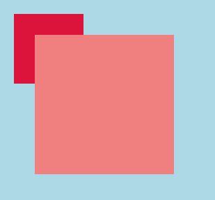
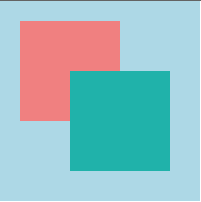
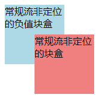

# Ch09L54 堆叠上下文


## 1 基本概念

堆叠上下文（`stack context`，以下简称 `SC`），它是一块区域，这块区域由某个元素创建，它规定了该区域中的内容 **在 Z 轴上排列的 *先后顺序***。


## 2 创建堆叠上下文的元素

1. `html`（根元素）
2. 设置了 `z-index`（值不为 `auto`）的 **定位元素**

这非常类似于 `BFC` 块级格式化上下文的层次模型：


## 3 同一个堆叠上下文中元素在 Z 轴上的排列

z 轴从后到前的排列顺序依次为：

1. 创建堆叠上下文的元素的背景和边框
2. 堆叠级别（即 `z-index` 的 `stack level`）为负值的 **堆叠上下文**
3. 常规流非定位的块盒
4. 非定位的浮动盒子
5. 常规流非定位行盒
6. 任何 `z-index` 是 `auto` 的定位子元素，以及 `z-index` 是 `0` 的堆叠上下文
7. 堆叠级别为正值的堆叠上下文


### 3.1. 创建堆叠上下文的元素的背景和边框

提问：容器的 `z-index` 比子元素更高，背景会覆盖子元素吗？
答：看情况。

实测：

```css
html { background-color: lightblue; }
.container {
    background-color: lightcoral;
    margin: 50px;
    height: 200px;
    width: 200px;
    position: relative;
    z-index: 10;  /* higher */
}
.item {
    background-color: crimson;
    width: 100px;
    height: 100px;
    position: absolute;
    left: -30px;
    top: -30px;
    z-index: -10; /* lower */
}
/*HTML: .container>.item */
```


可见，当容器创建了新的 `SC`，子元素的位置无论多低，都不会被覆盖。

但如果容器并不创建新的 `SC`，容器和子元素就同在 `html` 创建的 `SC` 中，覆盖才会发生。例如，注释上述第 8 行容器元素的 `z-index` 样式、或改为 `auto`，使其不创建新的 `SC`：

```css
.container {
    /* ... */
    z-index: auto;  /* or comment out this line */
}
```

此时，子元素背景被父容器覆盖：




### 3.2. 堆叠级别为负值的堆叠上下文

很显然，同一 `SC` 内 `z-index` 为负的被正值元素覆盖。

但如果都是相同的负数，则先渲染的在下，后渲染的在上：

```css
.container {
    background-color: lightblue;
    height: 200px;
    width: 200px;
    position: absolute;
    left: 0;
    top: 0;
    z-index: 0;
}
.container>div {
    width: 100px;
    height: 100px;
    position: absolute;
}
.item1 {
    background-color: lightcoral;
    left: 20px;
    top: 20px;
    z-index: -10; /* same stack level */
}
.item2 {
    background-color: lightseagreen;
    left: 70px;
    top: 70px;
    z-index: -10; /* same stack level */
}
/*HTML: .container>.item$*2 */
```




### 3.3. 常规流非定位的块盒

`z-index` 为负值的元素，肯定比普通块盒更靠后：

```css
div {
    width: 100px;
    height: 100px;
}
.positioned {
    background-color: lightblue;
    z-index: -10;
}
.non-positioned {
    background-color: lightcoral;
    margin: -50px 0 0 50px;  /* to overlap */
}
/*HTML: 
.positioned{常规流非定位的负值块盒}+.non-positioned{常规流非定位的块盒} 
*/
```

效果：



### 3.4. 非定位的浮动盒子

### 3.5. 常规流非定位行盒

### 3.6. 任何 z-index 是 auto 的定位子元素，以及 z-index 是 0 的堆叠上下文

### 3.7. 堆叠级别为正值的堆叠上下文


每个堆叠上下文，独立于其他堆叠上下文，它们之间不能相互穿插。
