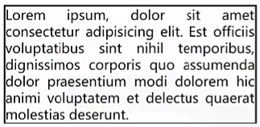

# Ch10L59 样式补充

## display:list-item

设置为该属性值的盒子，本质上仍然是一个块盒，但同时该盒子会附带另一个盒子

元素本身生成的盒子叫做 **主盒子**，附带的盒子称为 **次盒子**，次盒子和主盒子水平排列

涉及的css：

1. `list-style-type`：设置次盒子中内容的类型

2. `list-style-position`：设置次盒子相对于主盒子的位置

3. 速写属性 `list-style`：`list-style: disc inside;`

**清空次盒子**

`list-style:none`


## 图片失效时的宽高问题

如果 `img` 元素的图片链接无效，`img` 元素的特性和普通行盒一样，无法设置宽高


## 行盒中包含行块盒或可替换元素

行盒的高度与它内部的行块盒或可替换元素的高度无关


## text-align:justify

text-align:

- `left`：左对齐
- `right`：右对齐
- `center`：居中
- `justify`：**除最后一行外**，分散对齐



> [!note]
>
> 如何使最后一行也分散对齐呢？
>
> 答：利用 `::after` 伪元素，充当整个内容的最后一行：
>
> ```css
> .container::after {
>     content: "";
>     display: inline-block;
>     width: 100%;
> }
> ```
>
> L4 是为了保证新生成一行。


## 制作一个三角形

即内容区宽高为0、分别设置四个方向的边框。


## direction 和 writing-mode

开始 `start` -> 结束 `end`
左 `left` -> 右 `end`

开始和结束是相对的，不同国家有不同的习惯

左右是绝对的

`direction` 设置的是开始到结束的方向

`writing-mode`：设置文字书写方向


## utf-8字符

写在HTML中：`&#xe611;`

写在伪元素或样式类中：`content: '\e611';`
