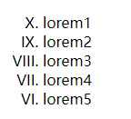
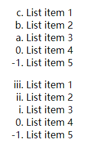

## Ch3L04 HTML进阶篇 - 高级标签


> [!Important]
>
> HTML 本质上是欧美人士用其母语（英语）记录网页呈现逻辑的一套符号系统。
>
> 因此会英语是有天然优势的。


## 1 空格的作用

**空格** 在 HTML 充当的是 **英文单词分隔符**。因此不能单纯当成文本使用，多个空格默认只渲染一个空格。

非要渲染多个，要用到字符实体 `&nbsp;`，`nbsp` 是 `non-breaking space` 的缩写，表示 "不换行空格"。

此外还有一个 `&emsp;`，它是 `em space` 的缩写，表示 "等宽空格"。在排版中，`&emsp;` 通常被用来插入一个 **较宽的空格**，其宽度与当前字体的字母 `M` 的宽度相等。因为 `M` 是等宽字体中最宽的字母之一，所以 `emsp` 也被称为 "等宽空格"。

`&emsp;` 的宽度通常为当前字体大小的 1 倍。这意味着在视觉上可能会比普通空格更宽一些，因为它的宽度是相对于字体大小而言的。

`&emsp;` 常用于需要精确控制空白宽度的排版场景，例如在表格中 **对齐文本**，或者在排版时 **确保等宽间距**。


## 2 常见的 HTML 字符实体

- `&lt;`：小于
- `&gt;`：大于
- `&nbsp;`：空格


## 3 换行标签 `br`

`<br>` 或 `<br />`，其中的 `br` 表示 **换行**（line **br**eak）。

此外还有水平分隔符 `<hr>`，`hr` 的全称是 "**h**orizontal **r**ule"，用得不多

> [!tip]
>
> `<br>` 与 `<br />` 的区别
>
> 它们之间的区别在于语法形式和兼容性方面。
>
> 1. **`<br>`**：
>    - `<br>` 是传统的 HTML 语法形式，表示换行。在传统的 HTML 中，通常不需要在 `<br>` 标签后添加斜杠。
>    - 在 HTML 中，`<br>` 标签被解析为换行，但是并不是一个自闭合标签，因此不需要添加斜杠。
> 2. **`<br />`**：
>    - `<br />` 是 XHTML 或 XML 中的语法形式，表示换行，并且是一个自闭合标签，需要在标签名后面添加斜杠以表示标签的结束。
>    - 在 XHTML 或 XML 中，标签必须是自闭合的，因此需要使用 `<br />` 这种形式来表示换行。
>
> 在 HTML5 中，`<br>` 和 `<br />` 都被允许使用，并且在 HTML5 中它们都是等效的。因此，你可以根据个人偏好或者代码风格选择使用哪种形式。
>
> 总的来说，`<br>` 是传统的 HTML 语法形式，而 `<br />` 则是 XHTML 或 XML 中的语法形式。在 HTML5 中，它们被视为等效的，但在 XHTML 或 XML 中，需要使用 `<br />` 这种自闭合形式。


## 4 有序列表标签 `ol`

`ol` 全称为 "**o**rdered **l**ist"，即 **有序列表**

`ol` 的 `type` 属性值有五个：

1. `1`：阿拉伯数字
2. `a`：小写英文字母
3. `A`：大写英文字母
4. `i`：小写罗马数字
5. `I`：大写罗马数字

`ol` 的 `start` 属性值为手动指定的起始序号，默认为 `1`，**只能为数字**

`ol` 逆序渲染，通过开关属性 `reversed` 控制：

```html
<ol type="I" start="10" reversed>
    <li>lorem1</li>
    <li>lorem2</li>
    <li>lorem3</li>
    <li>lorem4</li>
    <li>lorem5</li>
</ol>
```

效果：



编号一旦出现负数或 0，则统一显示为阿拉伯数字：

```html
<ol type="a" reversed start="3">
    <li>List item 1</li>
    <li>List item 2</li>
    <li>List item 3</li>
    <li>List item 4</li>
    <li>List item 5</li>
</ol>
<ol type="i" reversed start="3">
    <li>List item 1</li>
    <li>List item 2</li>
    <li>List item 3</li>
    <li>List item 4</li>
    <li>List item 5</li>
</ol>
```

效果：




## 5 无序列表 `ul`

`ul` 全程为 "**u**nordered **l**ist"，即 **无序列表**

`ul` 的 `type` 属性控制子项样式，取值有三类：

- `disc`：实心圆
- `circle`：空心圆
- `square`：实心矩形


## 6 图片标签 `img`

`src` 属性值可以是：

1. 网上 URL
2. 本地相对路径
3. 本地绝对路径

`alt` 属性：图片占位符，页面无法加载时展示出的容错信息

`title` 属性：图片提示符，鼠标悬停于图片上时展示的说明文本


## 7 锚点标签 `a`

`a` 是英文 "**a**nchor" 的缩写，意为“锚点”

在新标签打开：`target="_blank"`

`href` 属性：全称为 "**h**ypertext **ref**erence"，超文本引用，用于指定超链接的目标地址。

`href` 的三个作用：

- 超链接
- 定位锚点
- 打电话：`<a href="tel:13812345678">xxx</a>`
- 发邮件：`<a href="mailto:cheng.ji@alibaba-inc.com">E-mail</a>`
- 协议限定符：`<a href="javascript:while(1){alert(123)}">Dead Loop</a>`


## 8 表单标签 `form`

论代码可读性的重要——前端工程师的价值，体现在项目的维护上，而不全是在新功能开发上。

编程就是在量化（具体化）、训练你的思维，因此现在（2017年）出来创业的人大部分都是搞编程的，因为思维非常清晰。

真正的高手，往往都是先预期一个结果，然后一步步调整、逼近目标。
