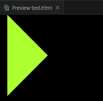

# Ch4L07 CSS 复杂选择器，权重计算问题，CSS 基础属性


浏览器渲染时，是按 **从右到左** 的顺序逐一查找的：

```css
section div ul li a em { background-color: red; }
```

先找 `em`，然后 `a`……


并列选择器：

```css
div.demo { color: red; }
```

同一元素，通过 **权重** 决定生效的规则集。


分组选择器：

```css
em, strong, span { color: pink; }
```


设置字体大小（`font-size`），本质是设置 **字体的高度**

乔布斯的第一个作品，是 `Arial` 字体。


三种方法设置字体颜色：

1. 土鳖式：颜色英文单词 `red`（不够精准）
2. 颜色代码：`#ff0000`
3. 颜色函数：`rgb(255, 0, 0)`

如果 16 进制的三原色值是重复的，则可以简写成一个：`#f00`


用 `border` 属性绘制三角形（微信对话框的小尖角）

```html
<head>
    <style>
    body { background-color: #000; }
    div {
        width: 0px;
        height: 0px;
        border-left: 100px solid greenyellow;
        border-top: 100px solid transparent;
        border-right: 100px solid transparent;
        border-bottom: 100px solid transparent;
    }
    </style>
</head>
<body>
    <div></div>
</body>
```

效果：


