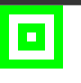
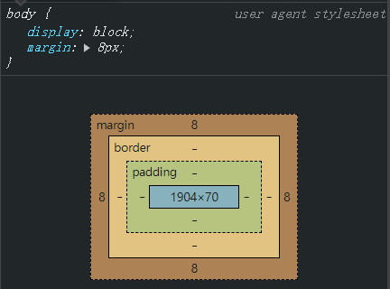
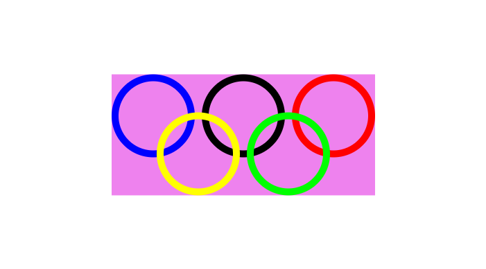

# Ch4L09 CSS 企业开发经验、惯例、盒模型、层模型

时长：2:03:42


单行文本垂直居中：

```css
div {
    height: 200px;
    line-height: 200px;
}
```


首行空两格：

```css
div {
    text-indent: 2em;
}
```

`em` 为英文字母 M 所占大小，`1em` 就是 1 倍 `font-size`。


`text-decoration` 的取值：

- `line-through`：中划线
- `underline`：下划线
- `overline`：上划线
- `none`：无划线

`cursor` 属性，悬停时出现：

- `pointer`：小手指
- `help`：问号
- `not-allowed`：禁止符号


## 1 伪类选择器

如 `a:hover`


## 2 `display` 属性

元素的类型：

- `inline`：行级（内联）
- `block`：块级
- `inline-block`：行级块（内联块级）

标签默认样式：（可手动修改）

```css
span { display: inline; }
div { display: block; }
img { display: inline-block; }
```

凡是带 `inline` 的元素，都自带 **文字特性**（即用分隔符进行分隔）

因此多个 `img` 图片元素间的空格，不要使用 `margin` 去除，直接删除中间的空白即可：

```html
<!-- Before -->


<!-- After -->

```


## 3 公司惯例用法

推荐：先定义一个功能（样式），再配置该功能。


标签选择器的作用：**初始化标签的默认样式**

通配符选择器：**初始化所有标签的默认样式**（因为权重为 0）

```css
* { 
    padding: 0; 
    margin: 0; 
}
```


## 4 盒模型

盒模型的四部分：

- `margin`
- `padding`
- `border`
- content（`width` + `height`）


## 5 绘制视力图

思路：从内向外，依次扩充 `padding`。外层宽高依次递增两倍 `padding`

```html
<style>
    * {
        margin: 0;
        padding: 0;
    }

    .demo4 {
        width: 10px;
        height: 10px;
        padding: 0;
        background-color: #fff;
    }

    .demo3 {
        width: 10px;
        height: 10px;
        padding: 10px;
        background-color: #0f0;
    }

    .demo2 {
        width: 30px;
        height: 30px;
        padding: 10px;
        background-color: #fff;
    }

    .demo1 {
        width: 50px;
        height: 50px;
        padding: 10px;
        background-color: #0f0;
    }
</style>
<body>
    <div class="demo1">
        <div class="demo2">
            <div class="demo3">
                <div class="demo4"></div>
            </div>
        </div>
    </div>
</body>
```

实测效果：




## 6 body 默认的外边距

`8px`：




## 7 层模型

- `position: absolute;`：**脱离原来的位置** 进行定位（立交桥、公寓楼）
- `position: relative;`：**保留原来的位置** 进行定位（灵魂出窍）
- `position: fixed`：广告定位（配合 `top` 和 `left`）

`absolute` 是相对于 **最近的**、**有定位的** *父级元素* 进行定位（具体通过 `top` 和 `left`）；如果不存在这样的父级元素，则相对于 **文档** 进行定位。

`relative` 是相对于自己出生时的原始位置进行定位。

最佳实践：用 `relative` 做参照物，再用 `absolute` 相对该参照物进行定位。


## 8 元素居中

`margin` 取负的一半宽高：

```css
.demo {
    width: 100px;
    height: 100px;
    background-color: red;
/* ------------------------ */
    position: absolute;
    top: 50%;
    left: 50%;
    margin-top: -50px;
    margin-left: -50px;
}
```

或者用 `transform` 的平移：

```css
.demo {
    width: 100px;
    height: 100px;
    background-color: red;
/* ------------------------ */
    position: absolute;
    top: 50%;
    left: 50%;
    transform: translate(-50%, -50%);
}
```


## 作业：居中奥运五环



```css
* { margin: 0; padding: 0; }

.box {
    width: 380px;
    height: 175px;
    background-color: violet;
    /* make center */
    position: absolute;
    top: 50%;
    left: 50%;
    transform: translate(-50%, -50%);
}

.circle {
    position: absolute;
    width: 100px;
    height: 100px;
    border-radius: 50%;
    border-width: 10px;
    border-style: solid;
}

.demo1 {
    border-color: #00f;
    top: 0;
    left: 0;
}

.demo2 {
    border-color: #000;
    top: 0;
    left: 130px;
}

.demo3 {
    border-color: #f00;
    top: 0;
    left: 260px;
}

.demo4 {
    border-color: #ff0;
    top: 55px;
    left: 65px;
}

.demo5 {
    border-color: #0f0;
    top: 55px;
    left: 195px;
}
```

```html
<body>
    <div class="box">
        <div class="circle demo1"></div>
        <div class="circle demo2"></div>
        <div class="circle demo3"></div>
        <div class="circle demo4"></div>
        <div class="circle demo5"></div>
    </div>
</body>
```

