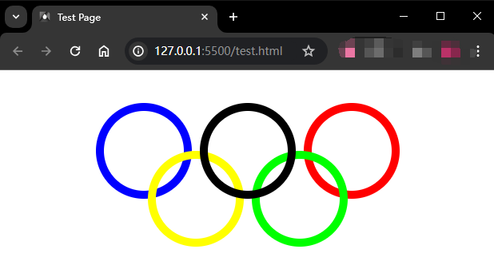

# Ch5L10 五环居中、两栏布局、两个Bug、BFC


## 1 上节作业：五环居中

圆圈直径：100px，边界宽度：10px，水平间隔：10px，垂直偏移：60px

HTML骨架：

```html
<div class="olympic-rings">
    <div class="ring blue"></div>
    <div class="ring black"></div>
    <div class="ring red"></div>
    <div class="ring yellow"></div>
    <div class="ring green"></div>
</div>
```

CSS样式：

```css
* { margin: 0; padding: 0; }

.olympic-rings {
    /* background-color: violet; */
    position: absolute;
    width: calc(260px + 100px + 20px);
    height: calc(60px + 100px + 20px);
    top: 50%;
    left: 50%;
    transform: translate(-50%, -50%);
}

.ring {
    position: absolute;
    width: 100px;
    height: 100px;
    border: 10px solid;
    border-radius: 50%;
}

.blue {
    border-color: #00f;
    top: 0;
    left: 0;
}

.black {
    z-index: 1;
    border-color: #000;
    top: 0;
    left: 130px; /* 120 + 10间隔 */
}

.red {
    border-color: #f00;
    top: 0;
    left: 260px; /* (120 + 10间隔) * 2 */
}

.yellow {
    border-color: #ff0;
    top: 60px;  /* 50 + 10边框 */
    left: 65px; /* 50 + 10边框 + (10 / 2)间隔 */
}

.green {
    border-color: #0f0;
    top: 60px;  /* 50 + 10边框 */
    left: 195px;  /* [50 + 10边框 + (10 / 2)间隔] + (100 + 10边框 * 2 + 10间隔) */
}
```

最终效果：




## 2 两栏布局

假设要实现如下布局效果：


分析：总共分三步——

1. 方块先渲染，黑条次之；
2. 方块利用绝对定位，让后面的文档流（黑条）自动上移；
3. 设置黑条的边距，解决因绝对定位导致的覆盖问题。

HTML：

```html
<body>
    <div class="pink"></div>
    <div class="black"></div>
</body>
```

CSS：

```css
* { margin: 0; padding: 0; }

.pink {
    width: 100px;
    height: 100px;
    background-color: pink;
    /* detach from current flow */
    position: absolute;
    right: 0;
}

.black {
    height: 100px;
    background-color: black;
    margin-right: 100px; /* avoid overlap */
}
```

> [!note]
>
> 这种布局方式必须考虑元素的渲染顺序，设为绝对定位的，**必须是先渲染的元素**


## 3 Bug1：margin 塌陷

描述：容器内的子元素 **上边距**，会出现 **塌陷** 效果：

如图，黑框内的粉框，本想置于容器内 **右下方** :arrow_lower_right:，但由于上边距塌陷，实际只能位于 **右上方** :arrow_upper_right: ：


HTML：

```html
<div class="black">
    <div class="pink"></div>
</div>
```

CSS：

```css
* { margin: 0; padding: 0; }

.black {
    height: 100px;
    width: 100px;
    background-color: black;
    margin: 50px;
}

.pink {
    height: 50px;
    width: 50px;
    background-color: pink;
    margin-left: 50px;
    margin-top: 50px; /* collapsed */
}
```

解决方案：将父元素设置为 `BFC` 元素（四选一）——

- `position: absolute | fixed;`
- `display: inline-block | table-cell | table-caption | flex | inline-flex | grid | inline-grid;`
- `overflow: hidden | auto | scroll;`
- `float: left | right;`

> [!tip]
>
> `BFC`：全程为 **B**lock **F**ormating **C**ontext，译为【块级格式化上下文】。
>
> A block formatting context (sometimes called a BFC) is a region of the page in which elements are laid out. A block formatting context itself is part of the surrounding document flow, but it isolates its contents from the outside context. This isolation does three things for the element that establishes the BFC: 
> 1. It contains the top and bottom margins of all elements within it. They won’t collapse with margins of elements outside of the block formatting context.
> 2. It contains all floated elements within it.
> 3. It doesn’t overlap with floated elements outside the BFC.
>
> from: *CSS in Depth*, P103, Manning, 2018


## 4 Bug2：margin 合并

并列两个 `div`，其外边距会自动合并（重叠）：


HTML：

```html
<body>
    <div class="pink"></div>
    <div class="black"></div>
</body>
```

CSS：

```css
* { margin: 0; padding: 0; }

.square {
    height: 50px;
    width: 50px;
}

.pink {
    background-color: pink;
    margin: 50px;
}

.black {
    background-color: black;
    margin: 25px;
}
```

如果用 BFC 的知识，人为增加一个父级 `div`，并设置一个 BFC 触发样式，看似就能解决这个问题：

```html
<style>
    .box { overflow: hidden; }
</style>
<body>
    <div class="square pink"></div>
    <div class="box">
        <div class="square black"></div>
    </div>
</body>
```

但实际上最佳实践选择 **不处理该 Bug**：因为引入新的 HTML 的代价过大。

结论：

- `margin` 塌陷仅改动 CSS 就能解决，不引入新的 HTML，因此可以考虑解决；
- `margin` 合并必须 HTML 和 CSS 同时改动，代价过大，因此不予处理。


## 5 float 浮动模型

`float: left | right;`

浮动元素产生了 **浮动流**（并非严格意义上的 **分层**）

浮动流内的元素的可见性：

|             相对于……             |       可见性       |
| :------------------------------: | :----------------: |
|             块级元素             |        :x:         |
|             BFC 元素             | :heavy_check_mark: |
|               文本               | :heavy_check_mark: |
| 文本类属性（带 `inline` 样式的） | :heavy_check_mark: |

正因为对块级元素不可见，才会导致容器 `div` 包不住里面的浮动 `div`：


HTML：

```html
<div class="box">
    <div class="square">1</div>
    <div class="square">2</div>
    <div class="square">3</div>
</div>
```

CSS：

```css
* { margin: 0; padding: 0; }

.box { border: 5px solid black; }

.square {
    width: 100px;
    height: 100px;
    background-color: violet;
    float: left;
}
```

此时可以通过在容器内的末尾，新增一个块级元素，并设置 `clear: both;` 消除浮动流：

HTML：

```html
<div class="box">
    <div class="square">1</div>
    <div class="square">2</div>
    <div class="square">3</div>
    <p style="clear: both;"></p>
</div>
```

效果：


