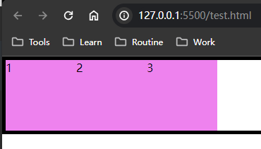
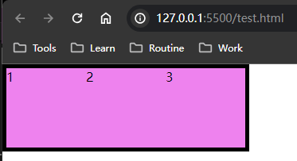
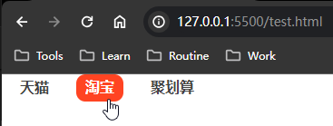

# Ch5L12 包裹浮动元素、开发实例、经验


## 0 权重复习

|         项目          |   权重   |
| :-------------------: | :------: |
|     `!important`      | Infinity |
|       行间样式        |   1000   |
|          id           |   100    |
| class \| 属性 \| 伪类 |    10    |
|  标签 \| **伪元素**   |  **1**   |
|      通配符 `*`       |    0     |


## 1 伪元素——解决浮动元素不被包裹的问题

伪元素：（**pseudo-element**）的特点：

- 可被 CSS 当做元素正常操作，但没有 HTML 的结构；
- `content` 属性 **只能** 用在 **伪元素** 中；
- 默认是 **行级元素**，要想宽高生效，必须改为块级元素；
- 也可以 **单独定位**，让伪元素变成一个可见的色块，实现某个需求；
- 过犹不及，过度使用可能有性能问题（**页面重绘**）

因此，要包裹浮动流中的元素，可以用伪元素实现（不引入多余的 HTML）：

```css
.box::after {
    content: "";
    display: block;
    clear: both;
}
```

再次重申：

**要想 clear 属性生效，当前元素必须是【块级元素】**

**要想 clear 属性生效，当前元素必须是【块级元素】**

**要想 clear 属性生效，当前元素必须是【块级元素】**

对应HTML：

```html
<style>
    /* Basic styles */
    * { margin: 0; padding: 0; }
    .box { border: 5px solid black; }
    .square {
        width: 100px;
        height: 100px;
        background-color: violet;
        float: left;
    }
</style>
<body>
    <div class="box">
        <div class="square">1</div>
        <div class="square">2</div>
        <div class="square">3</div>
    </div>
</body>
```

效果和新增一个 `p` 元素一样，但更符合最佳实践：




> [!tip]
>
> 常见的伪元素：
>
> ```css
> /* 1. 用于在元素的内容 `前` 插入生成的内容*/
> span::before 
> /* 2. 用于在元素的内容 `后` 插入生成的内容*/
> span::after  
> /* 3. 用于选取文本块的第一个字母，并可对其应用特殊样式 */
> p::first-letter
> /* 4. 允许开发者自定义用户选择文本时的样式 */
> ::selection { 
>     /* Spring Doc selected text - light theme */
>     background-color: #4C7C2C;
>     color: white;
> }
> /* 5. 用于设置占位符内容的样式 */
> ::placeholder { color: red; }
> ```


## 2 其他解决方案

除了清除浮动流，还可以将容器也变为浮动的：

```css
.box {
    float: left;
}
```



可以看到，容器不再有富余宽度。原因是：浮动流内的元素默认自带 `inline-block` 属性，容器宽高由里面的总宽高决定。

> [!tip]
>
> 拓展：怎样让 `span` 自带宽高？
>
> 方案一：变为 BFC 元素：
>
> ```css
> span { position: absolute; width: 100px; height: 100px; }
> ```
>
> 方案二：变为浮动元素：
>
> ```css
> span { float: left; width: 100px; height: 100px; }
> ```
>
> 原理都是让其变为块级元素。


## 3 浮动的应用场景

最早的应用场景是图片等内容 **在报刊类网页** 中的布局。


## 4 导航栏实战



HTML：

```html
<body>
    <ul class="nav">
        <li class="item"><a href="#">天猫</a></li>
        <li class="item"><a href="#">淘宝</a></li>
        <li class="item"><a href="#">聚划算</a></li>
    </ul>
</body>
```

CSS：

```css
* {
  margin: 0;
  padding: 0;
  font-family: Arial, Helvetica, sans-serif;
  color: #424242;
  font-weight: bold;
}

.nav {
  list-style: none;
}
.item {
  float: left;
  margin: 0 10px;
  height: 30px;
  line-height: 30px;
  /* border: 1px solid #ccc; */
}
a {
  text-decoration: none;
  display: block;
  padding: 0 10px;
}
a:hover {
  background: #f42;
  color: #fff;
  border-radius: 10px;
}
.nav::after {
  display: block;
  content: "";
  clear: left;
}
```

> [!note]
>
> 1. L29 - L33 为了清除浮动流，不影响后续内容
> 2. 要“撑开” `a` 元素，需要变为块级元素
> 3. 文字两边的颜色区，通过 `padding` 内边距实现
