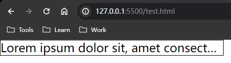
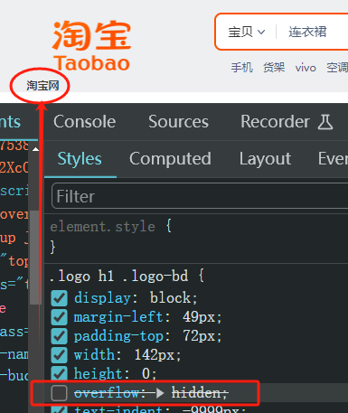

# Ch6L13 文字溢出处理、背景图片处理、企业开发经验


## 1 文字溢出处理

分两种情况：

- 单行文本：CSS 处理
- 多行文本：手动处理

### 单行文本

固定写法：

```css
p {
    white-space: nowrap;
    overflow: hidden;
    text-overflow: ellipsis;
}
```

> [!tip]
>
> 关于 `white-space`
>
> 根据 MDN 官方文档，这个属性指定了两件事：
>
> - 空白字符是否[合并](https://developer.mozilla.org/zh-CN/docs/Web/CSS/white-space#合并空白字符)，以及如何合并。
> - 是否换行，以及如何换行。
>
> `nowrap` 表示和 `normal` 一样[合并](https://developer.mozilla.org/zh-CN/docs/Web/CSS/white-space#合并空白字符)空白符，但阻止源码中的文本换行。

例如：

```css
p {
  width: 300px;
  height: 20px;
  line-height: 20px;
  border: 1px solid #000;
  /* text ellipsis */
  white-space: nowrap;
  overflow: hidden;
  text-overflow: ellipsis;
}
```

效果：




### 多行文本

PC 端在技术上实现较难，常用 **前端传参 + 后端手动追加省略号**（`...`）。

而移动端由于用的通常是新版浏览器，则可以通过 CSS3 的相关设置解决。


### 设置多行文本

通过 `height` 和 `line-height` 的比例 **手动计算** 确定。例如两行：

```css
p {
  height: 40px;
  line-height: 20px;
}
```


## 2 背景图片设置

- `background-image: url(./path/to/image/file);`：引入背景图片；
- `background-size: 100px 100px;`：分别为图片 x 和 y 方向的尺寸；
- `background-repeat: no-repeat;`：还可以是 `repeat`、`repeat-x`、`repeat-y`；
- `background-position: 100px 100px;`：分别为图片 x 和 y 方向的尺寸；

其中 `background-position` 的值很灵活，可以是：

- 具体像素值；
- 百分比：居中时，是以图片的 **正中心** 为基础；
- 表示方位的值：`left`、`right`、`top`、`bottom`、`center`


## 3 企业 Logo 图的样式处理

不仅要考虑正常情况渲染成图片，还要考虑极端情况下（如网速不好（低于10 kb/s？）无法加载 CSS）不影响使用。

解决方案：利用 `padding-top` + 隐藏溢出文本。

```css
.logo h1 .logo-bd {
  display: block;
  margin-left: 49px;
  padding-top: 72px;
  width: 142px;
  height: 0;
  overflow: hidden;
  text-indent: -9999px;
  background: url(//gw.alicdn.com/imgextra/i3/O1CN01uRz3de23mzWofmPYX_!!6000000007299-2-tps-143-59.png) 0 0 no-repeat;
  background-size: contain;
  background-position: center;
}
```

淘宝 HTML：

```html
<h1>
    <a href="//www.taobao.com?spm=a21bo.jianhua/a.201857.1.5af92a89PPpVu8" role="img" class="logo-bd clearfix" data-spm-anchor-id="a21bo.jianhua/a.201857.1">淘宝网</a>
</h1>
```

屏蔽 `overflow: hidden;` 可看到隐藏文本：




## 4 标签嵌套注意事项

1. 行级元素 **只能** 嵌套行级元素；块级元素可以嵌套 **任何元素**。
2. `p` 内嵌套 `div`，渲染时将会被 `div` 切分成两个 `p` 标签。
3. `a` 内严禁嵌套其他 `a` 标签。


## 5 作业

实现淘宝网首页第一屏静态页面（一周时间）。
