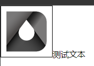
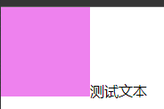
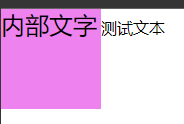

# Ch6L15 CSS升华篇-CSS 要点补充说明


## 1 大内容区居中

设置 `margin: 0 auto;`：

```html
<style>
* { margin: 0; padding: 0; }
.wrapper {
  height: 30px;
  background-color: #000;
}
.content {
  width: 600px;
  height: 30px;
  background-color: deeppink;
  margin: 0 auto;
}
</style>
<div class="wrapper">
    <div class="content"></div>
</div>
```


## 2 图片之间的空隙问题

凡是带有 `inline` 样式的元素，都会表现出 **文本的特点**，空格或空白都会视为 **分隔符**。

所以当多个 `img` 标签之间存在回车等换行符，实际渲染时会出现一个空格。解决方法：清除回车。


## 3 文本和块级元素的对齐问题

正常情况下，块级元素和文本是 **用各自的底边对齐**。

比如图片和文本：



再如 `div` 和文本：



但是，一旦 `div` 内部包含文字，则与 **内部文字的底边** 对齐了：



```html
<style>
* { margin: 0; padding: 0; }
.box {
  width: 100px;
  height: 100px;
  background-color: violet;
  display: inline-block;
  font-size: 2.5em;
}
</style>
<body>
    <div class="box">内部</div>测试文本
</body>
```


## 4 顶部两边的左右对齐

通过对容器 `float: left;` 和 `float: right;` 实现。

