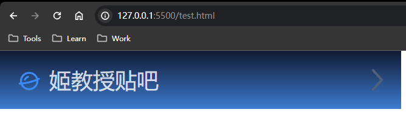
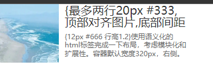
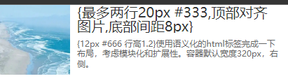

# Ch6L16 CSS升华篇-项目演练


## 1 用伪类设计前缀后缀

效果图：



用伪类实现一个带前后缀效果的列表项。（用上下内边距将文字挤到中间）

```css
* { margin: 0; padding: 0; }

.box {
  color: rgba(255, 255, 255, 0.8);
  background: linear-gradient(to bottom, rgb(17, 26, 50), rgb(61, 124, 209));
  width: 200px;
  height: 12px;
  /* above is defaults */
  padding: 10px 10px;
  line-height: 12px;
  font-size: 12px;
}

.box::before {
  display: inline-block;
  content: "";
  width: 12px;
  height: 12px;
  background: url(../prefix.png) no-repeat;
  background-size: 100% 100%;
  margin-right: 5px;
  vertical-align: -2px;
}

.box::after {
  display: block;
  content: "";
  width: 6px;
  height: 12px;
  background-image: url(../arrow.svg);
  background-size: 100% 100%;
  float: right;
}
```


## 2 阿里 CSS 样式面试题

{最多两行20px #333，顶部对齐图片，底部间距8px}
{12px #666 行高1.2}使用语义化的html标签完成一下布局，考虑模块化和扩展性。容器默认宽度320px，右侧。

容器默认宽度320px，图片100*100
hover时容器宽度变成400px

```css
* { margin: 0; padding: 0; }

.container {
  /* border: 1px solid #000; */
  width: 320px;
}

.container:hover {
  width: 400px;
}

.image1 {
  height: 100px;
  width: 100px;
  float: left;
  margin-right: 10px;
}

.content1 {
  height: 40px;
  line-height: 20px;
  font-size: 20px;
  color: #333;
  margin-bottom: 8px;
  overflow: hidden;
}

.content2 {
  font-size: 12px;
  color: #666;
  line-height: 1.2em;
}
```

HTML：

```html
<div class="container">
    
    <p class="content1">{最多两行20px #333,顶部对齐图片,底部间距8px}</p>
    <p class="content2">{12px #666 行高1.2}使用语义化的html标签完成一下布局，考虑模块化和扩展性。容器默认宽度320px，右侧。</p>
</div>
```


效果图：（静态）



鼠标悬停后：




## 3 作业

淘宝网首屏静态页。
