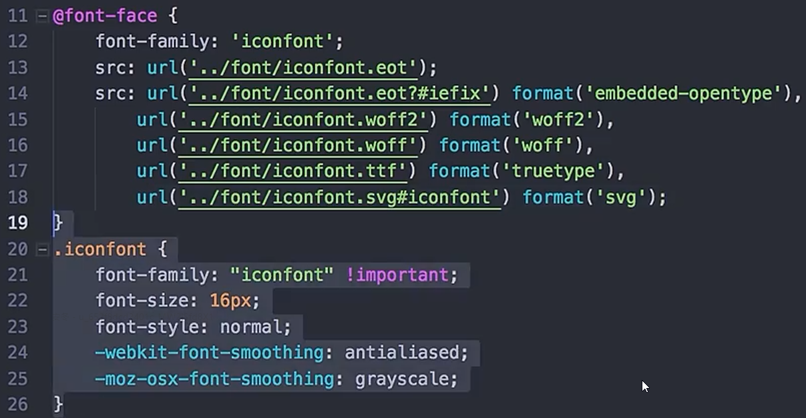

# Ch9L23 头部信息样式与自定义图标

## 1 图标字体 

`@font-face` 规则可以自定义字体系列，然后在具体的样式类中引用。

字体原始文件要放到项目文件夹中。

多个 `src` 引用是为了考虑兼容性，`format` 是为了提高引用效率，不要缺失。

具体使用：`span` 添加 `iconfont` 样式类，文本填写图标的 `Unicode` 编码。

**iconfont** 阿里图标库：https://www.iconfont.cn/

## 2 换行导致的空格问题

多个 `span` 元素因换行引入了多余的空格，但为了确保可读性又不想消除换行。此时可以在引入空格的元素（`li`）上设置字体大小为 0（`font-size: 0;`），再到子元素（`a` 标签）恢复字体大小。

