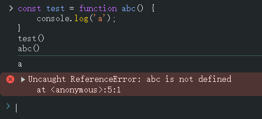
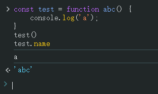
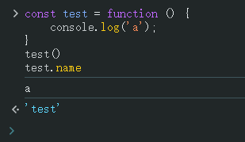
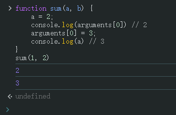
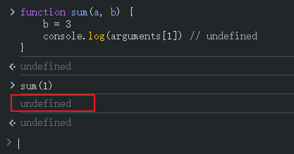

# Ch06L11 函数，小练习，初识作用域（上）


## 1 初识函数

函数的第一个作用：聚合代码，减少冗余。

编程原则：高内聚，低耦合。

函数的命名：小驼峰命名：`theFirstName`


## 2 命名函数表达式 vs 匿名函数表达式

```js
const test = function abc() {
    console.log('a');
}
test() // a
abc() // Error: abc is not defined
```

实测结果：



但是 `test.name` 的值变为 `"abc"`：



这种赋值方式后面的 `function` 函数称为 **命名函数表达式**。

与之相对的是 **匿名函数表达式**，即常说的 **函数表达式**：

```js
const test = function () {
    console.log('a');
}
test() // a
test.name // 'test'
```

实测结果：




## 3 函数的形参与实参

函数的第二个作用：对规则（业务逻辑）的抽象。

形参：函数声明（定义）时位于参数列表中的参数；

实参：实际调用函数时使用的参数。

用 `function` 定义函数时，函数体内可以通过一个类数组变量 `arguments` 获取到实际调用时传入的所有参数。该 `arguments` 变量也叫 **实参列表**。

虽然无法获取形参列表，但通过函数名的 `length` 属性可以得到形参列表的长度，即形参的个数。


## 4 任意参数个数的函数定义

旧版 `ES5`：利用 `arguments`：

```js
function sum() {
    var result = 0;
    for(var i = 0, len = arguments.length; i < len; i++) {
        result += arguments[i];
    }
    return result;
}
```

新版 `ES6`：利用剩余参数：

```js
function sum(...args) {
    return args.reduce((acc, cur) => acc + curr, 0);
}
```


## 5 形参与实参的映射规则

```js
function sum(a, b) {
    a = 2;
    console.log(arguments[0]) // 2
    arguments[0] = 3;
    console.log(a) // 3
}
sum(1, 2)
```

实测结果：



根据函数内部的 **映射规则**，形参取值改变时，实参列表对应位置的元素值也会同步改变，反之亦然（双向同步）；**但它们不是同一个变量**。

但是，当实参个数小于形参时，多出的形参不受映射规则影响：

```js
function sum(a, b) {
    b = 3
    console.log(arguments[1]) // undefined
}
sum(1) // undefined
```

实测结果：



