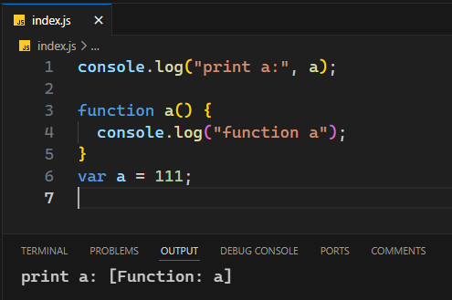
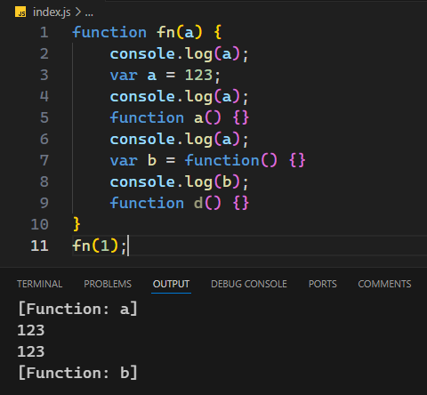
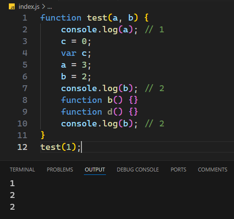
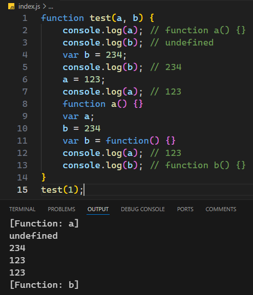
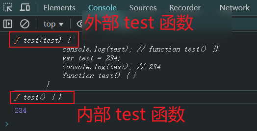
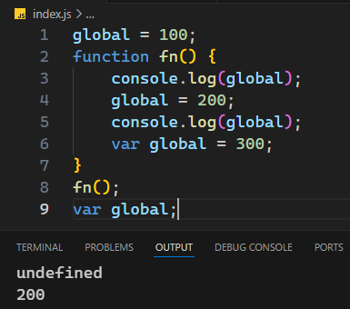
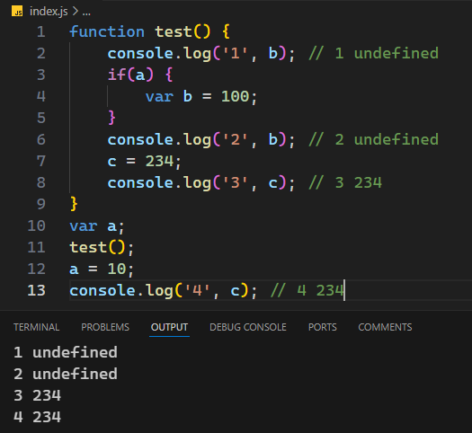
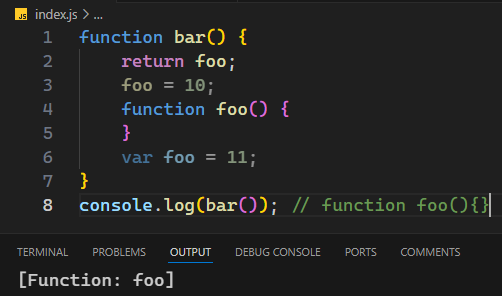
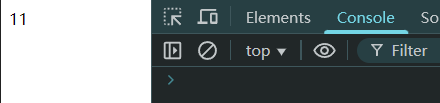

# Ch07L13 递归，预编译（上）


## 1 从 n 的阶乘理解递归

普通写法：

```js
// for loop
const fact1 = n => {
    let result = 1;
    for(let i = 1; i <= n; i++) {
        result *= i;
    }
    return result;
};
```

递归写法：

```js
const fact2 = n => n <= 1 ? 1 : n * fact2(n - 1);
```

尾递归优化：

```js
const fact3 = (n, acc = 1) => n <= 1 ? acc : fact3(n - 1, n * acc);
```

关于递归的执行过程，最好的案例（根据《自学是门手艺》改造）：

```js
const fn = n => {
  if (n === 1) {
    console.log(`\tn = ${n}, evaluating fn(${n}) ...`)
    console.log('Returning ...')
    console.log(`\tn = ${n} returns fn(1): 1`)
    return 1
  }
  console.log(`\tn = ${n}, evaluating ${n} * fn(${n - 1}) ...`)
  const r = n * fn(n - 1)
  console.log(`\tn = ${n} returns ${n} * fn(${n - 1}) = ${r}`)
  return r
}, start = (n = 5, f = fn) => {
  console.log(`Calling fn(${n}) ...`)
  console.log(`Get out of fn(n), and fn(${n}) = ${fn(n)}`)
};
start()
/*
Calling fn(5) ...
	n = 5, evaluating 5 * fn(4) ...
	n = 4, evaluating 4 * fn(3) ...
	n = 3, evaluating 3 * fn(2) ...
	n = 2, evaluating 2 * fn(1) ...
	n = 1, evaluating fn(1) ...
Returning ...
	n = 1 returns fn(1): 1
	n = 2 returns 2 * fn(1) = 2
	n = 3 returns 3 * fn(2) = 6
	n = 4 returns 4 * fn(3) = 24
	n = 5 returns 5 * fn(4) = 120
Get out of fn(n), and fn(5) = 120
*/
```


## 2 预编译

（`26:05` 起）

JS 执行三部曲——

1. 语法分析（语义分析）
2. 预编译
3. 解释执行（逐行）

测试：控制台最终输出什么——

```js
console.log('print a:', a);

function a() {
    console.log('function a')
}
var a = 111;
```

答案是输出提升后的函数。实测结果：



**图 7.1 关于函数提升和变量提升的实测结果截图**


**imply global**：暗示全局变量，即任何变量，如果变量未经声明就赋值，该变量就为全局对象所有。

一切声明的全局变量，都是 `window` 的属性。

`window` 就是全局。

预编译发生在函数执行的前一刻。

预编译四部曲：

1. 创建 AO 对象：Activation Object、活跃对象，即执行器上下文；
2. 查找形参和变量声明，将其名称作为 AO 属性名，并赋值 `undefined`；
3. 将实参值和形参统一（形参赋实参的值）；
4. 在函数体内查找函数声明，并赋值为对应的函数体。

示例：

```js
function fn(a) {
    console.log(a);  // function a() {}
    var a = 123;
    console.log(a);  // 123
    function a() {}
    console.log(a);  // 123
    var b = function() {}
    console.log(b);  // function() {}
    function d() {}
}
fn(1);
```

实测结果：



练习一：

```js
function test(a, b) {
    console.log(a); // 1
    c = 0;
    var c;
    a = 3;
    b = 2;
    console.log(b); // 2
    function b() {}
    function d() {}
    console.log(b); // 2
}
test(1);
```

实测结果：



练习二：

```js
function test(a, b) {
    console.log(a); // function a() {}
    console.log(b); // undefined
    var b = 234;
    console.log(b); // 234
    a = 123;
    console.log(a); // 123
    function a() {}
    var a;
    b = 234
    var b = function() {}
    console.log(a); // 123
    console.log(b); // function b() {}
}
test(1);
```

实测结果：




### 2.1 全局环境中的预编译

和函数体中的预编译过程略有不同，全局环境中的预编译 **没有实参向形参赋值** 的这步，并且第一步创建的对象叫 **全局对象（Global Object，即 GO）**。`GO` 即 `window`。

从时间先后顺序看，`GO` 的生成先于 `AO`：

```js
console.log(test);  // function test() {...}
function test(test) {
    console.log(test); // function test() {}
    var test = 234;
    console.log(test); // 234
    function test() {}
}
test(1);
var test = 123;
```

实测结果：



练习三：

```js
global = 100;
function fn() {
    console.log(global);  // undefined
    global = 200;
    console.log(global);  // 200
    var global = 300;
}
fn();
var global;
```

实测结果（有自己的变量一定用自己的）：




练习四：

```js
function test() {
    console.log('1', b); // 1 undefined
    if(a) {
        var b = 100;
    }
    console.log('2', b); // 2 undefined
    c = 234;
    console.log('3', c); // 3 234
}
var a;
test();
a = 10;
console.log('4', c); // 4 234
```

运行结果：




练习五：

```js
function bar() {
    return foo;
    foo = 10;
    function foo() {
    }
    var foo = 11;
}
console.log(bar()); // function foo(){}
```

实测结果：




练习六（百度 2013 笔面）：

```js
document.write(bar()); // 11
function bar() {
    foo = 10;
    function foo() {
        // body ...
    }
    var foo = 11;
    return foo;
}
```

运行结果：




