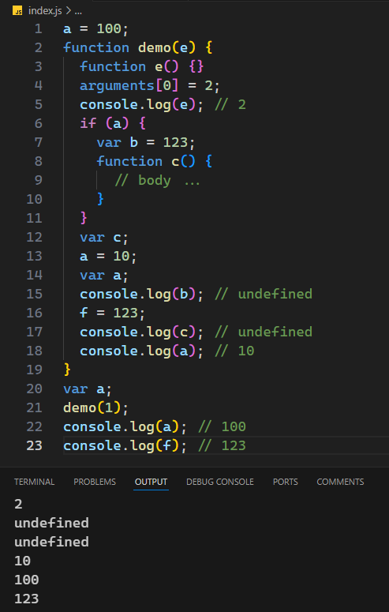
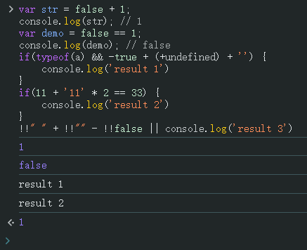

# Ch07L15 递归，预编译（下）


（接上节预编译笔记）

## 2 JS 预编译

练习七：

```js
a = 100;
function demo(e) {
  function e() {}
  arguments[0] = 2;
  console.log(e); // 2
  if (a) {
    var b = 123;
    function c() {
      // body ...
    }
  }
  var c;
  a = 10;
  var a;
  console.log(b); // undefined
  f = 123;
  console.log(c); // undefined
  console.log(a); // 10
}
var a;
demo(1);
console.log(a); // 100
console.log(f); // 123
```

实测结果：



> [!warning]
>
> **注意**
>
> 视频录制前一年，还允许在 `if` 语句声明函数（即 `function c(){}`），录制时至今 **已不合法**。因此 L17 过去应输出 `function c(){}`，现在输出 `undefined`。
>
> 记住一条最新规定即可：不能在 `if` 语句内声明函数。


## 3 习题课

习题一：

```js
var str = false + 1;
console.log(str); // 1
var demo = false == 1;
console.log(demo); // false
if(typeof(a) && -true + (+undefined) + '') {
    console.log('result 1') // result 1
}
if(11 + '11' * 2 == 33) {
    console.log('result 2') // result 2
}
!!" " + !!"" - !!false || console.log('result 3') // 1
```

实测结果：




习题二：

```js
var x = 1
if(function f() {}) {
    x += typeof(f)
}
console.log(x); // '1undefined'
```

这段代码的输出结果为`"1undefined"`，原因如下：

1. **变量初始化**：`var x = 1` 初始化 `x` 为数值 `1`。
2. **条件判断**：`if (function f() {})` 中的函数表达式会被视为真值（所有对象在布尔上下文中为 `true`），因此代码块内的语句会执行。
3. **作用域问题**：函数表达式 `function f() {}` 中的 `f` 仅在函数内部有效，外部无法访问。因此，`typeof(f)` 实际引用了未定义的变量 `f`，结果为 `"undefined"`。
4. **字符串拼接**：`x += typeof(f)` 等价于 `x = 1 + "undefined"`，数值 `1` 被转换为字符串 `"1"`，拼接后得到 `"1undefined"`。

**关键点**：

- 函数表达式的名称仅在其内部作用域有效。
- `typeof` 对未定义变量返回 `"undefined"`。
- 数值与字符串相加时，数值会被转换为字符串。

最终，`console.log(x)` 输出 `"1undefined"`。


增强记忆力的唯一有效方式——多阅读。


习题三：

```js
(window.foo || (window.foo = 'bar')); // bar
```

提示：先算右边的括号内的表达式，然后再算 `||`（出题有问题）。
