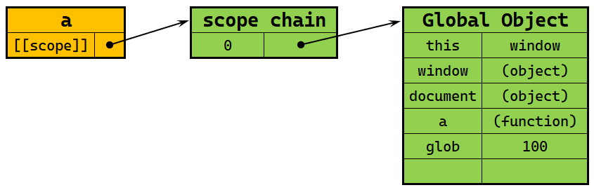
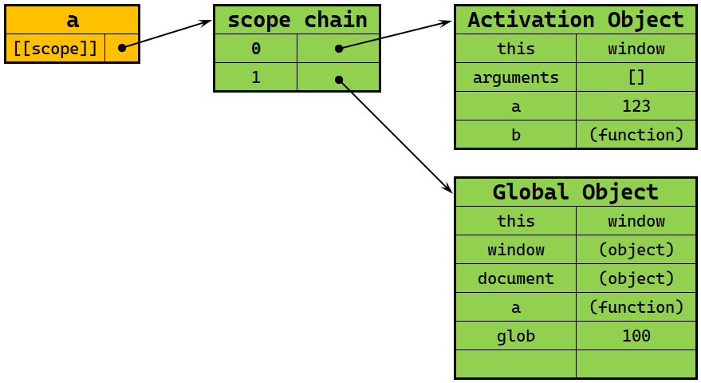
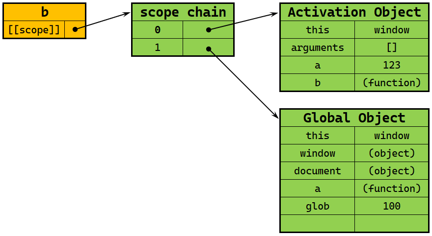
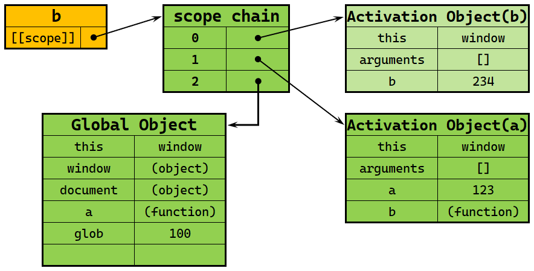
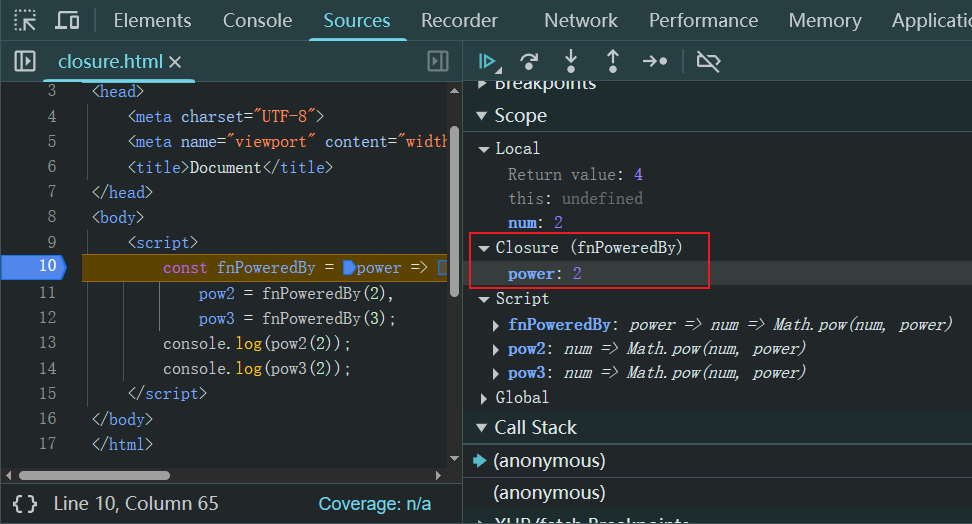

# Ch09L17 作用域、作用域链精解


## 1 作用域的核心概念

`[[scope]]`：每个 JavaScript 函数都是一个 **对象**，对象中有些属性我们可以访问，但有些不可以。这些不可访问的属性仅供 JavaScript 引擎读写，`[[scope]]` 就是其中之一。`[[scope]]` 指的就是我们所说的 **作用域**，其中存储了 **执行期上下文的集合**。

`作用域链`：即 `[[scope]]` 中所存储的执行期上下文对象的集合。该集合呈链式链接结构，人们称之为 **作用域链**。

`执行期上下文`：当函数执行时，会创建一个称为 **执行期上下文** 的内部对象。一个执行期上下文定义了一个 **函数执行时的环境**，函数每次执行时对应的执行上下文都是 **独一无二的**，所以多次调用一个函数会导致 **创建多个执行上下文**。当函数执行完毕，**它所产生的执行上下文** 被销毁。

**变量的查找方式**：从作用域链的 **顶端依次向下查找**。


## 2 作用域案例演示

```js
function a() {
    function b() {
        var b = 234;
    }
    var a = 123;
    b();
}
var glob = 100;
a();
```

作用域是跟函数走的（ES5）。运行上述代码将依次产生如下四种作用域状态：

1. 定义函数 `a()` 时；
2. 执行函数 `a()` 时；
3. 定义函数 `b()` 时；
4. 执行函数 `b()` 时；

第一阶段定义 `a()` 函数时的作用域：



第二阶段运行 `a()` 函数时的作用域：



第三阶段定义 `b()` 函数时的作用域（沿用 `a()` 建好的上下文环境）：



第四阶段运行 `b()` 函数时的作用域：



注意：

1. 在第三、第四阶段中的 `b()` 函数中，由函数 `a()` 创建的 `AO` 上下文与第二阶段运行函数 `a()` 创建的 `AO` 上下文 **是同一个对象**。
2. 根据 1 可知，如果在 `b()` 函数的 `AO` 中修改 `a()` 函数的 `AO` 上下文变量，待 `b()` 运行完毕，上述修改依旧会在 `a()` 中生效，直到该上下文销毁（即 `a()` 运行结束）。


> [!tip]
>
> **Chrome 浏览器提供的作用域链观测功能**
>
> `Chrome` 浏览器也在作用域链中引入了专门的 `Closure` 节点方便调试：
>
> 
