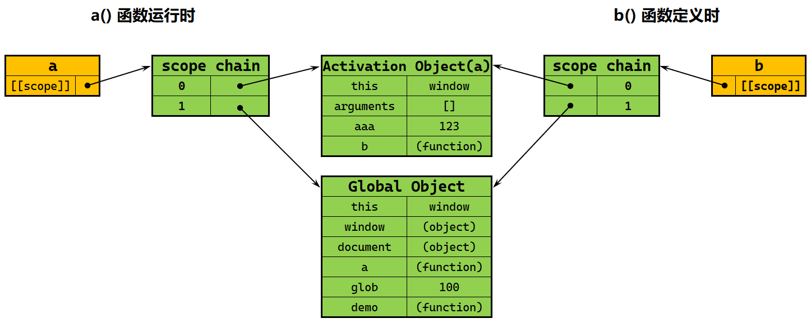
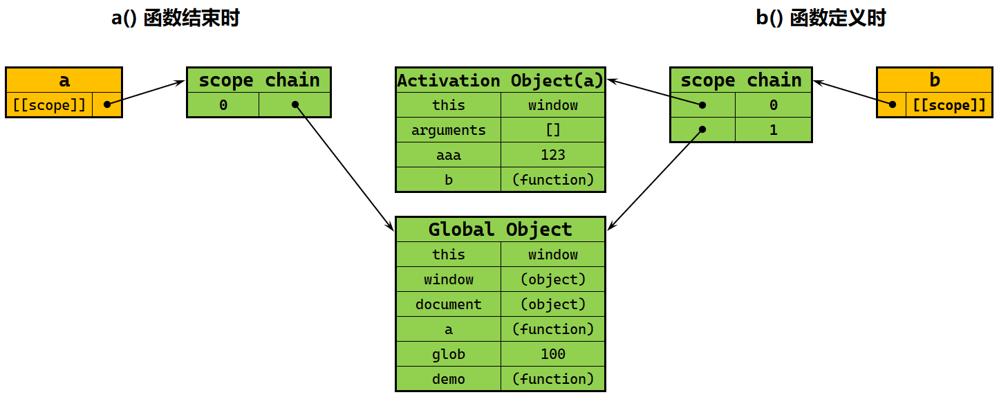
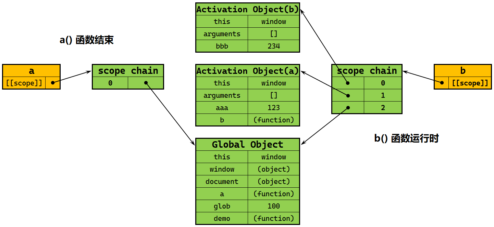
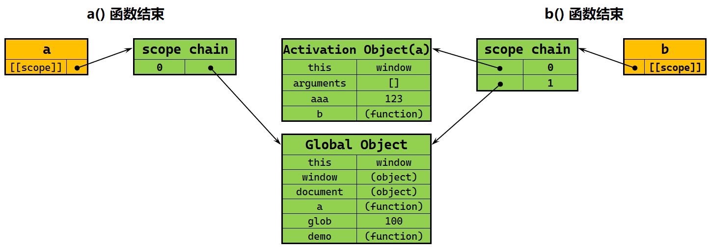

# Ch09L18 闭包、立即执行函数


## 1 闭包 Closure

演示代码：

```js
function a() {
    function b() {
        var bbb = 234;
        console.log(aaa);
    }
    var aaa = 123;
    return b;
}
var glob = 100;
var demo = a();
demo(); // 123
```

上述代码中，函数 `a()` 在运行时的作用域链、以及函数 `b()` 在定义时的作用域链示意图如下：



**图 9.5 函数 b 定义时的作用域链也就是函数 a 在运行时的作用域链**

而当函数 `a()` 运行结束后（L10），`a()` 与其执行期上下文 `AO` 断开，但是函数 `b()` 仍保留了对 `AO` 的引用：



**图 9.6 函数 a 运行结束时会断开与其执行期上下文 AO 的引用，但函数 b 不会**

而当函数 `b()` 运行时，函数 `a()` 创建的 `AO` 对象会一直被引用：



**图 9.7 函数 b 运行时函数 a 已经运行结束，但此时函数 b 的作用域链仍然有对 a 创建的执行期上下文对象 AO 的引用**

最后，即便函数 `b()` 运行结束，`b()` 的作用域链中仍有对 `a()` 的执行期上下文的引用，并且只要变量 `demo` 一直有效，该引用就会一直存在：



**图 9.8 函数 b 运行结束后，仍然保有对 a 函数执行期上下文对象的引用。这就是闭包的特点**

因此，但凡是内部的函数通过某种方式（如 `return` 语句）被保存到了外部，就 **必定会生成闭包**。

闭包会导致原有作用域链无法释放，造成 **内存泄漏**。

> [!tip]
>
> **关于内存泄露**
>
> 即 `memory leakage`，其实是从剩余可用内存的隐性流失的角度而言的，而不是像数据泄露那样的显示流失。


## 2 闭包的作用

闭包练习：

```js
function a() {
    var num = 100;
    function b() {
        console.log(++num);
    }
    return b;
}
var demo = a();
demo(); // 101
demo(); // 102
```

### 2.1 作用一：实现公有变量

例如计数器累加：

```js
function add() {
    var count = 0;
    return function() {
        console.log(++count);
    }
}
var counter = add();
counter();  // 1
counter();  // 2
counter();  // 3
counter();  // 4
```


### 2.2 作用二：可以做缓存（存储结构）

案例一（缓存内部状态 `num`）：

```js
function test() {
    var num = 100;
    function a() {
        console.log(++num);
    }
    function b() {
        console.log(--num);
    }
	return [a, b]
}
var opsArr = test();
opsArr[0]();  // 101
opsArr[1]();  // 100
```


案例二（缓存 `food`）：

```js
function eater() {
    var food = "";
    return {
        eat: function() {
            console.log(`I'm eating ${food}`);
            food = "";
        },
        push: function(myFood) {
            food = myFood;
        }
    }
}
var theEater = eater();
theEater.push('banana');
theEater.eat();  // I'm eating banana
```


### 2.3 作用三：可以实现封装（属性的私有化）

（未展开）


### 2.4 作用四：模块化开发（防止污染全局变量）

（未展开）


## 3 立即执行函数（IIFE）

特点：执行完就销毁。

`W3C` 推荐写法：

```js
(function(){
    // body ...
}())
```

`IIFE` 也可以有返回值、也有预编译过程（也会生成 `GO`、`AO` 上下文）。

`IIFE` 类似 `CSS` 中的 `Float` 布局，并非官方原生设计。

除了推荐写法，`IIFE` 还有几种其他写法（强化基础）：

（1）函数声明不会被执行：

```js
function test() {
    console.log(123);
}() // Uncaught SyntaxError: Unexpected token ')'
```

（2）只有表达式才会被执行符号执行：

```js
function test() {
    console.log(123);
}
test(); // 123

+function test1() {
    console.log(234);
}() // 234

-function test2() {
    console.log(345);
}() // 345

!function test3() {
    console.log(456);
}() // 456
console.log(test3); // undefined
```

也可以利用逻辑运算符的短路原理人为设计一个表达式（确保执行到 `IIFE` 部分）：

```js
undefined || function test3() {
    console.log(111);
}() // 111

1 && function test3() {
    console.log(222);
}() // 222
```


（3）能被执行符号 `()` 执行的表达式，其函数名会被忽略：

```js
var test = function() {
    console.log('a');
}(); // a
console.log(typeof(test));  // undefined
```

> [!tip]
>
> **对 test 为 undefined 的再理解**
>
> 上述代码等效于两部分：
>
> 1. 变量声明：`var test;`
> 2. 变量赋值：`test = function() { console.log('a') }();`，因为赋值符号 `=` 的左边必须有一个变量，以构成一个完整的 **函数表达式**。
>
> 但在第二步中，由于使用了 `IIFE`，函数运行后随即销毁，因此左边的变量并未被真正赋值。


（4）数学小括号的使用

引入一对小括号（L1、L3）：

```js
(function test() {
    console.log(123);
})() // 123
```

此时小括号内为表达式，因此可以用后面的执行符号 `()` 直接运行 `IIFE`。

进一步，执行符号 `()` 也可以移入小括号内，变成推荐写法：

```js
(function test() {
    console.log(123);
}()) // 123
```

之所以可以这样写，是因为最外围的数学小括号 **先执行**，括号内的执行符号 **后执行**。


（5）不报错但也不执行 `IIEF` 的情况

```js
function test(a, b, c, d) {
    console.log(a, b, c, d);
}(1, 2, 3, 4);  // 4

// 上述代码等效于以下两部分（与 IIFE 执行无关）：
function test(a, b, c, d) {
    console.log(a, b, c, d);
}

(1, 2, 3, 4);  // 4
```

注意 L10 中，逗号也是运算符，结果是返回 **最后一个表达式的值**。


（6）DIY 补充：`IIFE` 内的函数名只能在函数内部引用（递归）：

```js
var fact5 = (function fn(n) {
    return n <= 1 ? 1 : n * fn(n - 1);
}(5));
console.log(fact5); // 120
```

