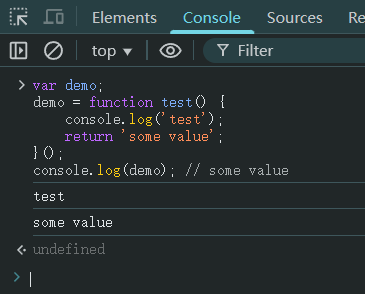

# Ch09L20 闭包精细版


## 1 计数器的三种实现

常规方法：

```js
var n = 0;
function test() {
    console.log(++n);
}
test(); // 1
test(); // 2
test(); // 3
```

使用闭包：

```js
function test() {
    var n = 0;
    return function() {
        console.log(++n);
    }
}
var counter = test();
counter(); // 1
counter(); // 2
counter(); // 3
```

不用闭包、利用函数也是对象的另类方案（多了一个临时属性 `attr`）：

```js
function test() {
    console.log(++test.attr || (test.attr = 0, ++test.attr))
}
test(); // 1
test(); // 2
test(); // 3
```


## 2 再探函数表达式与求值问题

考虑下列具名函数表达式：

```js
var demo = function test() {
    console.log('test');
}()
```

最后的执行符号 `()` 可以让控制台输出 `'test'`，且让变量 `demo` 失去对原函数 `test()` 的引用。

上述代码等效为：

```js
var demo;
demo = function test() {
    console.log('test');
}();
```

进一步，右边可以理解成一个 `IIFE`：

```js
var demo;
demo = (function test() {
    console.log('test');
}());
```

这样一来，`demo` 的值完全取决于 `IIFE` **是否有返回值**：上述写法在第 3 行后暗含一个 `return;` 语句，因此返回值为 `undefined`；如果明确返回一个值，`demo` 的值将随之改变：

```js
var demo;
demo = function test() {
    console.log('test');
    return 'some value';
}();
console.log(demo); // some value
```

实测结果：




## 3 求字符串的字节长度

```js
// Solution 1: 原始版
function getByteLength(str) {
    var len = 0;
    for(var i = 0; i < str.length; i++) {
        if(str.charCodeAt(i) <= 255) {
            len++;
        } else {
            len += 2;
        }
    }
    return len;
}

// Solution 2: 改进1
function getByteLength(str) {
    var len = str.length;
    for(var i = 0; i < str.length; i++) {
        if(str.charCodeAt(i) > 255) {
            len++;
        }
    }
    return len;
}

// Solution 3: 改进2
function getByteLength(str) {
    var len, temp;
    len = temp = str.length;
    for(var i = 0; i < temp; i++) {
        if(str.charCodeAt(i) > 255) {
            len++;
        }
    }
    return len;
}

// Solution 4: 改进 DIY
function getByteLength(str) {
    return [...str]
        .map(s => s.charCodeAt(0) <= 255 ? 0 : 1)
        .reduce((acc, cur) => acc + cur, str.length);
}

// Testing
getByteLength('Hello 世界!'); // 11
```


## 4 逗号操作符

返回后一个值：

```js
var f = (
    function f() { return "1" },
    function g() { return 2 }
)();
typeof(f); // "number"
```

尽管在预编译阶段，外层 `f` 会变为内层的 `f()`，但执行过程中依旧会先处理逗号操作符，最终将函数 `g()` 的执行结果赋给外层变量 `f`。因此 `f` 的值为 `2`。


## 5 函数声明写到 if 判定中

考察如下代码：

```js
var x = 1;
if(function f() {}) {
    x += typeof f;
}
console.log(x); // 1undefined
```

解析：`function f() {}` 不在 `falsy` 范围内，因此可以执行 `if` 中的语句；又括号令其成为 `IIFE`，因此执行后立即销毁，后续就无法引用了；最后 `typeof` 一个未定义的变量返回 `"undefined"` 字符串，与前面的数字 `1` 拼接，得到最终的 `"1undefined"` 字符串。


> [!tip]
>
> **关于底层知识与上层知识**
>
> 底层知识：确保编程不出错，且能最快找到问题；在大厂中底层越扎实的人走得更远。
>
> 上层知识：确保编程速度快，但不容易快速定位并解决问题。新知识即便学慢点也无妨，毕竟不可能马上大幅应用到生产环境。
>
> 结论：底层知识很重要。


接口联调时后端数据的来源：通常第三方提供数据池，后端负责引入本地，前端负责渲染到页面。
