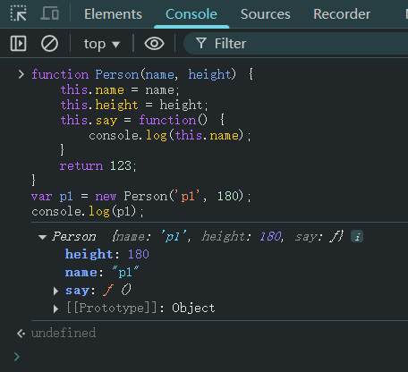
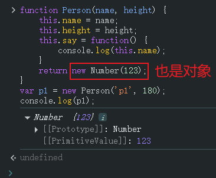
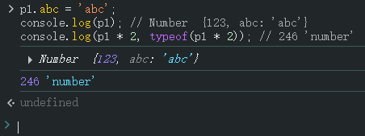

# Ch10L22 对象，包装类（下）


2017 年神预言未来经济走势。

一定要耐得住前期学习的枯燥。有一技傍身只是人生的起点，未来的路还很长。尽早未雨绸缪。


## 1 构造函数内部原理

总共三步：

1. 在函数体最前面隐式地加上 `this = {}`；
2. 执行 `this.xxx = xxx`；
3. 隐式地返回 `this`。

例如：

```js
function Person(name, height) {
    // var this = {}
    this.name = name;
    this.height = height;
    this.say = function() {
        console.log(this.name);
    }
    // return this;
}
```

神奇约定：带 `new` 关键字的返回值必须是一个对象：

```js
function Person(name, height) {
    this.name = name;
    this.height = height;
    this.say = function() {
        console.log(this.name);
    }
    return 123;
}
var p1 = new Person('p1', 180);
console.log(p1); // Person{...}
```

上述代码中，第 7 行返回的原始值会 **被强制忽略**，除非改为返回某个对象值。

实测结果：



但如果返回数字的封装对象，则是允许的：



此时 `p1` 可视为一个实例对象添加任意属性，但若参与数学运算，其结果将自动变为原始类型的普通数字：

```js
p1.abc = 'abc';
console.log(p1); // Number {123, abc: 'abc'}
console.log(p1 * 2, typeof(p1 * 2)); // 246 'number'
```

实测结果：




## 2 原始类型的包装类

对原始数字的封装：

```js
var num = 4;
num.len = 2; // 相当于 new Number(4).len = 2，随即销毁该对象
console.log(num.len); // undefined，相当于重新 new Number(4).len，因此未定义
```

对字符值的封装：

```js
var str = 'abcd';
str.length = 2;  // 相当于 new String('abcd').length = 2，然后销毁该对象
console.log(str, str.length); // 'abcd' 4
```

面试题：

```js
var str = 'abc';
str += 1;
var test = typeof(str);
if(test.length == 6) {
    test.sign = 'typeof的返回结果可能为String';
}
console.log(test.sign); // undefined
```

`test` 的值为 `"string"`，但是第 5 行相当于隐式创建了 `new String("string").sign = ...`，然后销毁该对象；到第 7 行相当于重新 `new String("string").sign`，因此为 `undefined`。

 

## 3 习题选讲

习题一：

```js
var x = 1, y = z = 0;
function add(n) {
    return n = n + 1;
}
y = add(x);
function add(n) {
    return n = n + 3;
}
z = add(x);
// x: 1, y: 4, z: 4
```

根据预编译，最终 `add()` 为后一个声明，由于函数体内部累加不影响 `GO` 中的 `x`，因此 `x` 始终为 `1`。


习题二：

```js
parseInt(3, 8); // 3
parseInt(3, 2); // NaN
parseInt(3, 0); // 3 或 NaN
```

最后一行在不同的浏览器会有不同的行为，因为对 `0` 进制的处理有争议。

