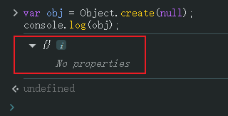
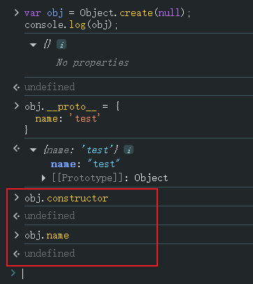
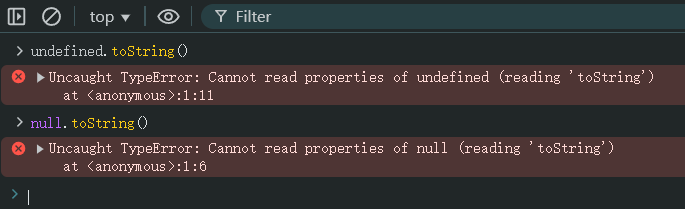
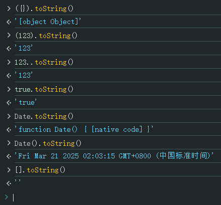
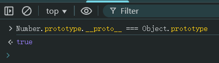
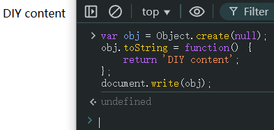
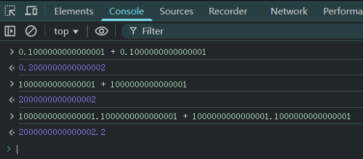

# Ch11L24 原型，原型链，callapply（下）


## 1 原型重新赋值：放上放下绝对不一样

放下面：

```js
Person.prototype.name = 'aaa';
function Person() {}
var p = new Person();
Person.prototype = {
    name: 'bbb'
};
console.log(p.name); // aaa
```

放上面：

```js
Person.prototype.name = 'aaa';
function Person() {}
Person.prototype = {
    name: 'bbb'
};
var p = new Person();
console.log(p.name); // bbb
```


## 2 原型链

原型链的连接点就是 `__proto__`。

上例中，`p.__proto__` 的值默认情况下为 `Person.prototype`，且可以手动修改。

同理：

```js
var obj1 = new Object();
obj1.__proto__ === Object.prototype // true
```

`Object.prototype` 也是原型链的终点。


## 3 Object.create(proto)

`Object.create(proto)` 能够以 `proto` 为原型对象创建一个对象实例。

也正因为 `Object.create()` 方法可以接收 `null`，因此并非所有对象的终极原型都为 `Object.prototype`，反例如下：

```js
var obj = Object.create(null);
console.log(obj); 
```

实测结果：



并且人为加上 `__proto__` 属性并赋值，JS 内部并不会恢复成一般对象：

```js
obj.__proto__ = {
  name: 'test'
}
obj.constructor  // undefined
obj.name  // undefined
```

实测结果：




## 4 另两个没有原型的特殊值

即 `undefined` 和 `null`：




## 5 toString() 方法

不同类型的值，其 `toString()` 结果不同：



以数字为例，最终结果是 `new Number(123).toString()` 返回的；它重写了 `Object.prototype` 的 `toString()` 方法：



类似的还有 `Array.prototype`、`Boolean.prototype`、`String.prototype` 等等，都是重写了其原型对象的 `toString()` 方法。

若要强制不使用重写后的 `toString()`，需要借助 `call()` 方法：

```js
Object.prototype.toString.call(123);   // '[object Number]'
```

执行 `document.write(value)` 时，底层输出到页面的是 `value.toString()` 的结果，如果 `toString()` 方法可以改写，则将输出其他内容：

```js
var obj = Object.create(null);
obj.toString = function() { 
    return 'DIY content';
};
document.write(obj);
```

运行结果：




## 6 JS 数字可正常计算的范围

小数点前后各 16 位：

```js
0.1000000000000001 + 0.1000000000000001 // 0.2000000000000002
1000000000000001 + 1000000000000001 // 2000000000000002
// 但不可同时 16 位：
1000000000000001.1000000000000001 + 1000000000000001.1000000000000001
// 2000000000000002.2
```

实测结果：




## 7 call 和 apply

作用：改变 `this` 指向。即 **借用别人的函数实现自己的功能**。

区别：后面传参的形式（写法）不同。

以 `call()` 为例：

```js
function Person(name, age) {
    this.name = name;
    this.age = age;
}
var obj = {};
Person.call(obj, 'p1', 10);
console.log(obj); // {name: 'p1', age: 10}
```

再看一个减少代码冗余的例子：

```js
function Person(name, age, gender) {
    this.name = name;
    this.age = age;
    this.gender = gender;
}
// 复用前：
function Student(name, age, gender, tel, grade) {
    this.name = name;
    this.age = age;
    this.gender = gender;
    this.tel = tel;
    this.grade = grade;
}
// 复用后：
function Student(name, age, gender, tel, grade) {
    Person.call(this, name, age, gender);
    this.tel = tel;
    this.grade = grade;
}
```

`apply` 只是把参数变为实参数组，即 `arguments`：

- `func.apply(thisObj, arguments)`
- `func.apply(thisObj, [arg1, arg2, arg3 ...])`
