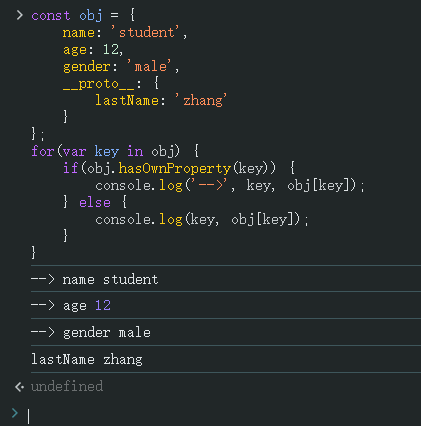

# Ch12L27 继承模式，命名空间，对象枚举（下）


## 1 全局变量冲突及应对策略


### 方案1：以对象为命名空间

```js
const obj = {
    depmt1: {
        user1: {
            name: 'user1'
        },
        user2: {
            name: 'user2'
        }
    },
    depmt2: {
        // ...
    }
};
const user1 = obj.depmt1.user1;
user1.name;  // user1
```


### 方案2：使用 webpack 工具

（未展开）


### 方案3：使用 IIFE

通过 `IIFE` 实现模块化开发，防止全局变量污染：

```js
function init() {
    initAd();
    initActivity();
    // ...
}
var initAd = (function(){
    var fn1 = function() {/*...*/}
    var fn2 = function() {/*...*/}
    var fn3 = function() {/*...*/}
    return function() {
        fn1();
        fn2();
        fn3();
    }
}());
```


## 2 jQuery 链式调用原理

```js
const operations = {
    find() {
        console.log('find ...');
        return this;
    },
    seek() {
        console.log('seek ...');
        return this;
    },
    run() {
        console.log('run ...');
        return this;
    }
};
operations
  .find()
  .seek()
  .run();
/*
find ...
seek ...
run ...
```


## 3 枚举/遍历

### 3.1 for-in 遍历

```js
const obj = {
    name: 'student',
    age: 12,
    gender: 'male',
    __proto__: {
        lastName: 'zhang'
    }
};
for(var key in obj) {
    if(obj.hasOwnProperty(key)) {
        console.log('-->', key, obj[key]);
    } else {
        console.log(key, obj[key]);
    }
}
```

实测结果：



`for-in` 遍历通常是和 `hasOwnProperty()` 连用。


### 3.2 in 操作符

```js
const obj = {
    name: 'student',
    __proto__: {
        lastName: 'zhang'
    }
};
'lastName' in obj   // true
```

`in` 包括原型链上的属性。


### 3.3 instanceof 操作符

`A instanceof B` 表示：对象 `A` 的原型链上是否存在 `B` 的原型。

应用：若 `obj` 的值可能为 `{}` 或 `[]`，如何加以区分？

```js
// Solution 1: constructor
({}).constructor  // ƒ Object() { [native code] }
([]).constructor  // ƒ Array() { [native code] }

// Solution 2: instanceof
({}) instanceof Array // false
([]) instanceof Array // true

// Solution 3: call + toString
Object.prototype.toString.call({}); // '[object Object]'
Object.prototype.toString.call([]); // '[object Array]'
```

