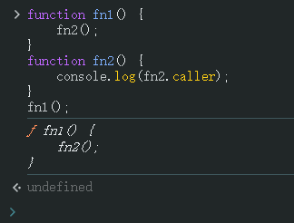
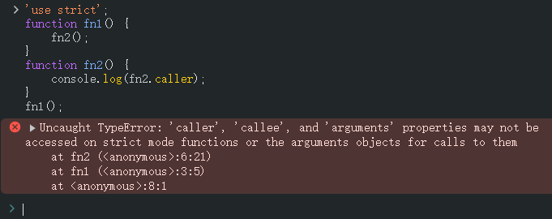
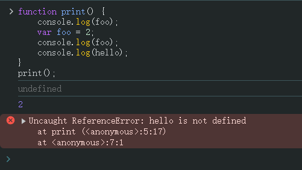

# Ch13L29 this，笔试真题讲解（下）


## 1 练习 this 指向

```js
var name = '222';
var a = {
    name: '111',
    say: function() {
        console.log(this.name);
    }
};
var b = {
    name: '333',
    say: function(func) {
        func();
    }
}
b.say(a.say); // 222
```

`a.say` 被传递给 `b.say` 后，`func()` 是直接调用的，走的是预编译阶段的函数定义，因此 `this` 指向全局对象 `window`。


## 2 arguments.callee

`arguments.callee` 指向所在的函数引用。

应用场景：

```js
var num = (function(n){
    if(n == 1) {
        return 1;
    }
    // return n * 阶乘(n - 1);
    return n * arguments.callee(n - 1);
}(10)); // 3628800
```

对于匿名函数，如果要调用自身，只能使用 `arguments.callee`：


## 3 function.caller

```js
function fn1() {
    fn2();
}
function fn2() {
    console.log(fn2.caller);
}
fn1();
```

`fn2.caller` 指代调用 `fn2()` 函数的当前环境：




> [!warning]
>
> **注意**
>
> 在严格模式下，`caller` 和 `arguments` 都不允许使用：
>
> 


## 4 面试题讲解

```js
function print() {
    console.log(foo); 
    var foo = 2; 
    console.log(foo); 
    console.log(hello);
}
print();
```

实测结果（如实记录结果）：




高阶函数练习：

```js
var bar = {a: '002'};
function print() {
    bar.a = 'a';
    Object.prototype.b = 'b';
    return function inner() {
        console.log(bar.a);  // a
        console.log(bar.b);  // b
    }
}
print()();
```


