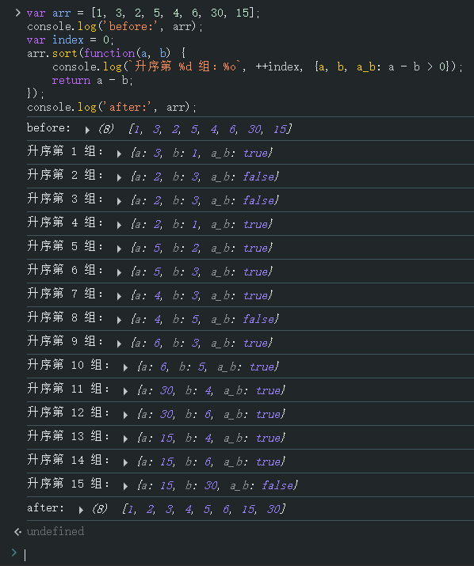

# Ch14L31 数组与三目运算符


## 1 数组的定义

两种方式：

```js
var arr = new Array(); // or new Array(length)
var arr = [];  // 字面量形式（推荐）
```

注意：`length` 参数必须为整数，否则报错。

对比 JS 对象的定义方式（4 种）：

1. 字面量：`var obj = {};`
2. 内置构造函数：`var obj = new Object();`
3. 自定义构造函数：`var person = new Person('zhangsan');`
4. 特殊方法：`var obj = Object.create(proto)`


## 2 数组的读写

可以溢出写，不可以溢出读（结果为 `undefined`）。


## 3 数组的方法

`push` 可以添加任意多个元素，返回新数组的长度。

`splice(start, deleteCount, ...items)`：其中 `start` 可以取负数，但小于 `-length` 后均按 `0` 处理：

```js
var arr = [1, 2, 3];
arr.splice(-5, 1, 'aaa', 'bbb'); // [1]
console.log(arr);  // ['aaa', 'bbb', 2, 3]
```


## 4 sort 排序

`sort(comparator)`：自定义排序规则 `comparator` 必须满足：

1. 必须是两个形参；
2. 返回值约定：
   1. 当返回值为负数：前面的形参放在前面
   2. 当返回值为正数：后面的形参放在前面
   3. 当返回值为零：顺序不变

因此数字的升序排序如下：

```js
var ascending = function(a, b) {
    if(a > b) {
        return 1;  // i.e. (a - b)
    } else if(a < b) {
        return -1; // i.e. (a - b)
    } else {
        return 0;  // i.e. (a - b)
    }
}
// 等效于（ES5）：
var ascending = function(a, b) {
    return a - b;
}
// 等效于（ES6）：
const ascNew = (a, b) => a - b;
```

其中，形参 `(a, b)` 每轮的取值 **并非按冒泡排序** 进行的，而是根据底层引擎动态决定排序算法的：

```js
var arr = [1, 3, 2, 5, 4, 6, 30, 15];
console.log('before:', arr);
var index = 0;
arr.sort(function(a, b) {
    console.log(`升序第 %d 组：%o`, ++index, {a, b, a_b: a - b > 0});
    return a - b;
});
console.log('after:', arr);
```

实测结果（**绝非冒泡排序**）：




数组乱序排序：`arr.sort((a, b) => Math.random() - 0.5);` 或 `arr.sort(() => Math.random() - 0.5)`


## 5 slice 函数

语法：`arr.slice(start?, end?)`，纯函数，无参时返回全部数组的拷贝（浅拷贝），截取范围：`[start, end)`。

浅拷贝验证：

```js
let aaa = [{a: 'aaa'},2,3];
let bbb = aaa.slice();
bbb[0].a = 'bbb';
console.log(aaa[0].a); // bbb
```

`arr.slice()` 的应用：将 `arguments` 类数组转为数组对象。


## 6 join 与 split

`join()` 默认用逗号连接字符串。`split(seperator)` 必须指定分隔符，否则原样输出。
