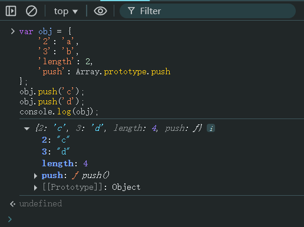
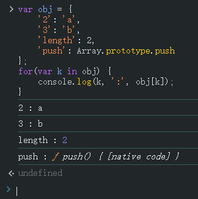
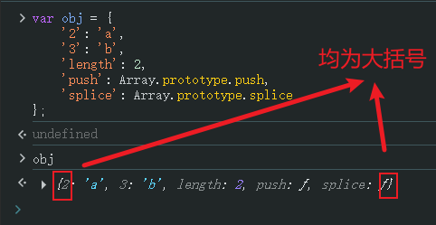

# Ch14L32 数组，类数组


## 1 深入理解类数组

类数组必须满足：

1. 属性要为索引属性（即数字）；
2. 必须有 `length` 属性；
3. 最好加上 `push` 方法。

阿里面试题：

```js
var obj = {
    '2': 'a',
    '3': 'b',
    'length': 2,
    'push': Array.prototype.push
};
obj.push('c');
obj.push('d');
console.log(obj);
```

实测：



分析：

```js
// obj.push() 的内部逻辑
Array.prototype.push = function(target) {
    obj[length] = target;
    obj.length++;
};
```

`length` 决定了要赋值的 `key` 的具体取值。

此外，`DOM` 集合对象几乎都是类数组，因此类数组的相关知识 **必须掌握**。

类数组可以用 `for-in` 遍历出键值对：

```js
var obj = {
    '2': 'a',
    '3': 'b',
    'length': 2,
    'push': Array.prototype.push
};
for(var k in obj) {
    console.log(k, ':', obj[k]);
}
```

实测：




> [!tip]
>
> **注意**
>
> 录课时，`obj` 对象加了 `push` 和 `splice` 方法后，控制台输出时会打印成类似数组的形态；实测时已经复原为按对象渲染：
>
> 


## 2 作业

1. 封装一个 `type()` 方法
2. 数组去重：要求在原型链上编程：`Array.prototype.unique`（11 行内）
