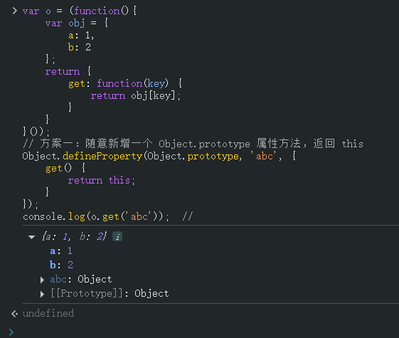
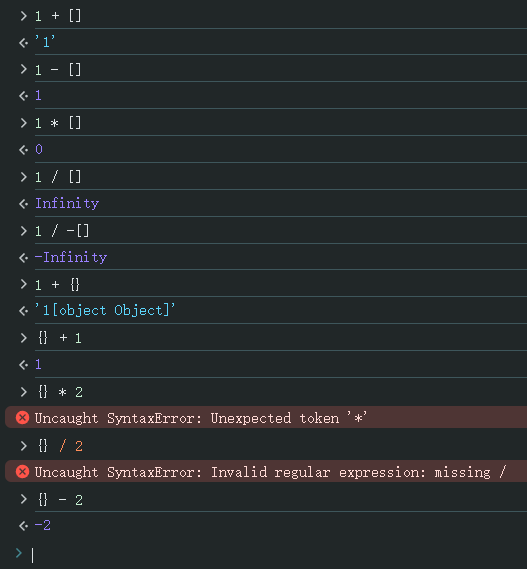
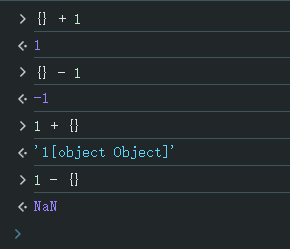
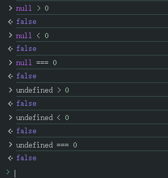

# Ch16L35 数组去重，习题，答疑复习（下）


## 1 Number 包装类的临时属性

```js
var num = 123;
num.abc = 'abc'; // 返回 abc：用 new Number(num) 封装
                 // 此时会临时新增一个 abc 属性保证不出错
                 // 然后随机销毁
console.log(num.abc);  // undefined：再次访问将无法读取到刚才的值
```


## 2 关于 proto 属性的值

```js
function Person(name) {
    // var this = Object.create(Person.prototype);
    // { __proto__: Person.prototype }
    this.name = name;
}
var person = new Person('abc');
```

第 2-3 行中 `this` 和 `__proto__` 的取值是其最准确的写法。

如果使用 `Object.create(proto)`，则其取值变为参数 `proto`：

```js
var demo = {lastName: 'deng'};
var obj = Object.create(demo);
// obj = { __proto__: demo }
```


## 3 不可配置的属性

即对象描述符中的 `configurable`，用 `var` 声明的全局变量不能用 `delete` 删除。


## 4 this 指向小结

分四种情况：

1. 预编译阶段：指向 `window`；
2. 谁调用，指向谁：调用 `test()` 相当于 `test.call()`
3. `call` / `apply` 手动指定 `this`；
4. 全局 `this` 指向 `window`；


## 5 关于闭包和私有属性的实现

（袁进）闭包情况下也可能修改到内部对象（闭包漏洞）——

尝试在不改变上述代码的情况下修改内部的 `obj` 对象：

```js
var o = (function(){
    var obj = {
        a: 1,
        b: 2
    };
    return {
        get: function(key) {
            return obj[key];
        }
    }
}());
// 方案一：随意新增一个 Object.prototype 属性方法，返回 this
Object.defineProperty(Object.prototype, 'abc', {
    get() {
        return this;
    }
});
console.log(o['abc']);  // {a: 1, b: 2}
```

实测：



漏洞根源：属性访问权限过大。修复方式：

1. 方案一：暴露给外部使用前，先用 `obj.hasOwnProperty(key)` 过滤一遍，确保原型链未被污染：

   ```js
   var o = (function(){
       var obj = {
           a: 1,
           b: 2
       };
       return {
           get: function(key) {
               if(obj.hasOwnProperty(key)) {
                   return obj[key];
               } else {
                   return undefined;
               }
           }
       }
   }());
   ```

2. 在闭包内部手动指定 `obj` 的原型为 `null`：

   ```js
   var o = (function(){
       var obj = {
           a: 1,
           b: 2
       };
       Object.setPrototypeOf(obj, null);
       return {
           get: function(key) {
               return obj[key];
           }
       }
   }());
   // or using Object.create(null) + Object.assign():
   var o = (function(){
       var obj = Object.assign(Object.create(null), {
           a: 1,
           b: 2
       });
       return {
           get: function(key) {
               return obj[key];
           }
       }
   }());
   ```


## 6 关于空数组和空对象加数字（别深究）

几种特殊情况：



空数组与数字 `1` 相加，等效于 `String([]) + 1`。

空对象与数字只能做加减，不能做乘除，且空对象 `{}` 只能写在前面，写在后面将变为 `NaN`：



> [!tip]
>
> 对象（引用值）的隐式类型转换过于复杂，**不用深究**。


## 7 关于 null 和 undefined 和数字比大小

结果全部为 `false`：




## 8 关于 var 声明的变量不能删除

面试题：

```js
(function(x){
    delete x;
    return x;
}(1));
```

预编译阶段时相当于 `var x;`，而 `var` 声明的变量是不能通过 `delete` 删除的。


## 9 作业

1. 一个字符串由 `[a-z]` 组成，找出首个只出现一次的字母；
2. 字符串去重；

```js
// Homework 1
function getFirstUnique(str) {
    var arr = str.split(''), result = null;
    for (var index in arr) {
        if(arr.filter(e => e === arr[index]).length === 1) {
            result = arr[index];
            break;
        }
    }
    return result;
}
// or using RegExp:
function getFirstUnique(str) {
  const pattern = p => new RegExp(p, 'g');
  for(let s of str.split('')){
    if(str.match(pattern(s)).length === 1){
      return s;
    }
  }
  return null;
}

// Homework 2
function deduplicate(str) {
    var result = [], temp = {}, arr = str.split('');
    for(var index in arr) {
        if(arr.hasOwnProperty(index) && !temp[arr[index]]) {
            temp[arr[index]] = true;
            result.push(arr[index]);
        }
    }
    return result.join('');
}
```

