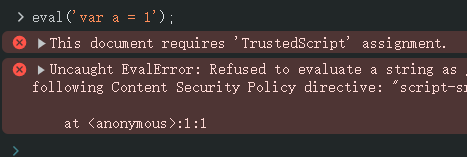

# Ch17L36 trycatch，es5标准模式


## 1 try-catch

`try-catch` 结构捕获的报错对象 `e` 有两个属性：`name` 和 `message`。其中 `name` 常见的取值有：

- `EvalError`：`eval()` 的使用与定义不一致时抛出，例如：

  ```js
  eval('var a = 1');
  ```

  

- `RangeError`：数值越界：

  ```js
  var arr = new Array(-20);
  ```

  

- `ReferenceError`：非法或不能识别的引用数值

- `SyntaxError`：发生语法解析错误

- `URIError`：URI 处理函数使用不当


## 2 严格模式

使用 `"use strict;"` 的原因：向后兼容，旧版浏览器渐进式增强的考虑。

严格模式可只对某个作用域生效。

严格模式下，不支持 `with(){...}` 语句、`arguments.callee`、`fn.caller` 调用；且变量必须先声明再赋值；且函数不能有重复参数。

`with` 语句示例：

```js
var obj = {
    name: 'obj'
};
var name = 'window';
function test() {
    var name = 'score';
    with(obj) { // with 会把该代码块内的 AO 最顶端的作用域节点变成 obj
        console.log(name);  // obj
    }
}
```

`with` 本来的用途，简化代码书写。

最大的问题：修改作用域链，系统内核性能可能会受到严重影响。
