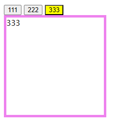
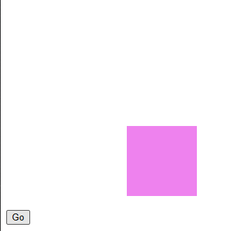
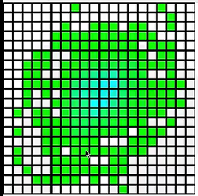

# Ch17L37 dom操作初探


`JavaScript` 不能直接修改 `CSS` 样式，只能通过行内样式间接变更元素 `style` 属性，从而变更样式。


## 案例一：色块颜色切换

（13:30）

```html
<div id="box"></div>
<script>
    const clickHandler = (function(){
        let flag = false;
        return function(ev) {
            const color = flag ? 'red' : 'green';
            div.style.backgroundColor = color;
            flag = !flag;
        }
    }());
    const div = document.querySelector('#box');
    div.style.width = '100px';
    div.style.height = '100px';
    div.style.backgroundColor = 'red';
    div.addEventListener('click', clickHandler);
</script>
```


## 案例二：选项卡切换

（27:32）

```html
<style>
    .content {
        display: none;
        width: 200px;
        height: 200px;
        border: 5px solid violet;
    }
    .active {
        background-color: yellow;
    }
</style>
<button>111</button>
<button>222</button>
<button>333</button>
<div class="content">111</div>
<div class="content">222</div>
<div class="content">333</div>
<script>
    const btns = Array.from(document.querySelectorAll('button'));
    const boxes = Array.from(document.querySelectorAll('.content'));
    btns.forEach(function(btn, i) {
        btn.addEventListener('click', function(ev) {
            // content boxes
            boxes.forEach(box => box.style.display = 'none');
            boxes[i].style.display = 'block';

            // toggle button's active class
            btns.forEach(e => e.classList.remove('active'));
            ev.target.classList.add('active');
        });
    });
</script>
```




## 案例三：色块滑动

（33:45）

通过闭包和 `IIFE` 控制 `setInterval()` 中的计数方式（匀速 / 加速），可以实现色块的灵活移动：

```html
<style>
    #box {
        width: 100px;
        height: 100px;
        background-color: violet;
    }
</style>
<div id="box"></div>
<button id="btn" style="position:fixed;top: 300px;">Go</button>
<script>
    const box = document.querySelector('#box');
    const btn = document.querySelector('#btn');
    box.style.position = 'absolute';
    box.style.top = '0';
    box.style.left = '0';

    btn.addEventListener('click', function (ev) {
        box.style.top = '0';
        box.style.left = '0';
        // const translate = (function() {
        //     let count = 0;
        //     return (spd = 10) => count += spd;
        // }());
        const speedup = (function () {
            let count = 1;
            return (pct = 0.05) => count += count * pct;
        }());
        let timer = setInterval(function () {
            const size = speedup();
            box.style.top = `${size}px`;
            box.style.left = `${size}px`;
            if (size > 200) {
                clearInterval(timer);
            }
        }, 10);
    })
</script>
```




## 案例四：通过方向键控制元素移动

（37:51）

```html
<style>
    #box {
        width: 100px;
        height: 100px;
        background-color: violet;
    }
</style>
<div id="box"></div>
<script>
    const box = document.querySelector('#box');
    const btn = document.querySelector('#btn');
    box.style.position = 'absolute';
    box.style.top = '0';
    box.style.left = '0';

    const {speedup, resetSpeed} = (function () {
        let count = 1;
        const speedup = (pct = 0.05) => count += count * pct;
        const resetSpeed = () => count = 1;
        return {
            speedup,
            resetSpeed
        };
    }());
    
    const KEY_UP = 38,
        KEY_DOWN = 40,
        KEY_LEFT = 37,
        KEY_RIGHT = 39;
    document.onkeydown = function ({which: key}) {        
        const speed = speedup();
        const top = parseInt(box.style.top);
        const left = parseInt(box.style.left);
        switch (key) {
            case KEY_UP:
                box.style.top = `${top - speed}px`;
                break;
            case KEY_DOWN:
                box.style.top = `${top + speed}px`;
                break;
            case KEY_LEFT:
                box.style.left = `${left - speed}px`;
                break;
            case KEY_RIGHT:
                box.style.left = `${left + speed}px`;
                break;
        }
        if(speed > 100) {
            box.style.top = '0';
            box.style.left = '0';
            resetSpeed();
        }
    };
</script>
```


## 案例五：用鼠标滑动实现网格涂鸦并变色

（54:02）

略。



