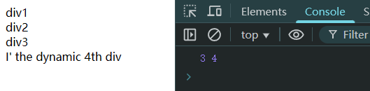

# Ch18L38 dom选择器，节点类型


## 1 document

`document` 代表整个文档（`html` 的父标签）。

`DOM` 标准 `API` 选出的元素集合对象，其类型均为 `类数组`。


## 2 关于 id 选择器

别太依赖 `id` 选择器，大型项目常作为顶级框架的名称使用，后台可能会根据 `id` 抽取内容（`Php`、`JSP` 等），最后替换成新的模块标识，导致后期代码整合联调时报错。

`HTML` 页面用得最多的选择器是 `class` 类选择器。

大厂通常会根据 `query` 词条定制不同的页面，同一词条一年内可能会多次迭代。


## 3 关于选择器的实时更新

`querySelector` 和 `querySelectorAll` 不是实时更新的，可以理解为静态的快照。

正因为不是实时的，因此适用场景也相当有限。

示例：

```html
<div>div1</div>
<div>div2</div>
<div>div3</div>
<script>
    const byQry = document.querySelectorAll('div');
    const byTag = document.getElementsByTagName('div');
    const newDiv = document.createElement('div');
    newDiv.textContent = "I' the dynamic 4th div";
    document.body.appendChild(newDiv);
    console.log(byQry.length, byTag.length); // 3 4
</script>
```

实测结果：




## 4 DOM 节点的类型

节点类型由定义在 Node 类型上的 12 个数值常量表示。共 12 个：

- 元素：`Node.ELEMENT_NODE`（1）
- 属性：`Node.ATTRIBUTE_NODE`（2）
- 文本：`Node.TEXT_NODE`（3）
- CDATA：`Node.CDATA_SECTION_NODE`（4）
- `Node.ENTITY_PREFERENCE_NODE`（5）
- `Node.ENTITY_NODE`（6）
- `Node.PROCESSING_INSTRUCTION_NODE`（7）
- 注释：`Node.COMMENT_NODE`（8）
- 文档：`Node.DOCUMENT_NODE`（9，即 `document`）
- 文档类型：`Node.DOCUMENT_TYPE_NODE`（10，即 `DOCTYPE`）
- 片段：`Node.DOCUMENT_FRAGMENT_NODE`（11，即 `DocumentFragment`）
- `Node.NOTATION_NODE`（12）

应用：

```js
if(someNode.nodeType == Node.ELEMENT_NODE) {
    alert('Node is an element.');
}
```


## 5 DOM 节点的四个属性

- `nodeName`：元素的标签名，大写形式表示，只读属性；
- `nodeValue`：仅 Text 节点和 Comment 节点的文本内容 **可读可写**；
- `nodeType`：只读属性；
- `attributes`：当前 Element 节点的属性集合。


## 6 高级架构师的作用

核心作用：分化、分解框架，让每个人协调配合的流程更快、更省时间、更好维护、更好拆解。

