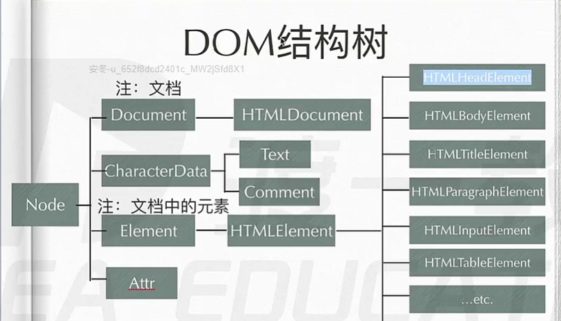
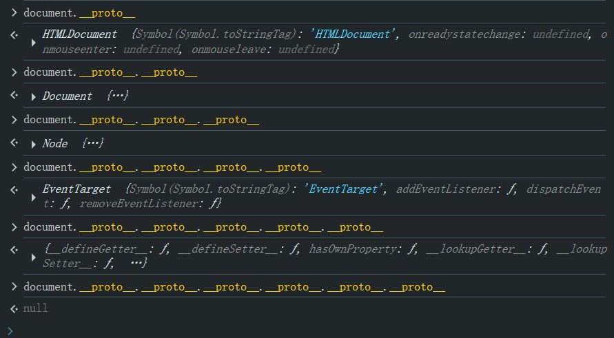

# Ch19L39 dom继承树，dom基本操作（上）


## 1 DOM 继承树



`document` 的原型链：`document --> HTMLDocument.prototype --> Document.prototype`，具体如下：

```
document
  |-- HTMLDocument
    |-- Document
      |-- Node
        |-- EventTarget
          |-- Object
            |-- null
```

实测：



注意：

1. `getElementById()` 方法定义在 `Document.prototype` 上，因此 `HTMLDocument` 和 `XMLDocument`（图中未画）均支持该方法；
2. （不常用）`getElementsByName()` 定义在 `HTMLDocument.prototype` 上，因此 `XML` 不能使用；
3. （最常用）`getElementsByTagName()` 定义在 `Document.prototype` **和** `Element.prototype` 上，因此可以直接在元素节点上使用该方法，不必非得从 `document` 选择元素，用于缩小检索范围，非常方便；类似的方法还有：
   1. `getElementsByClassName()`
   2. `querySelector()`
   3. `querySelectorAll()`
4. 可以直接使用 `document.body` 和 `document.head` 分别选中 `body` 和 `head` 元素；
5. `html` 元素通过 `document.documentElement` 访问；

