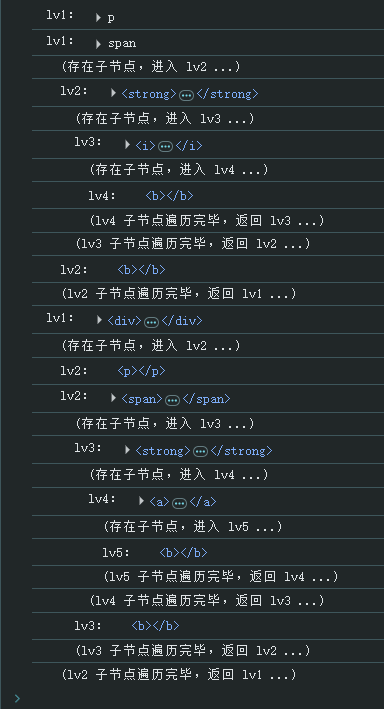

# Ch19L40 dom继承树，dom基本操作（中）


## 1 随堂练习讲解

### 1.1 元素节点树遍历

示例 HTML：

```html
<div class="target">
    <p></p>
    <span>
        <strong>
            <i>
                <b></b>
            </i>
        </strong>
        <b></b>
    </span>
    <div>
        <p></p>
        <span>
            <strong>
                <a>
                    <b></b>
                </a>
            </strong>
            <b></b>
        </span>
    </div>
</div>
```

方案一：不在原型链上实现（带格式输出）：

```js
function traverse(node, k = 1) {
    let childNodes = node.childNodes,
        tab = ' '.repeat(k * 2),
        tabNext = ' '.repeat((k + 1) * 2);
    for (let i = 0, len = childNodes.length; i < len; i++) {
        let iNode = childNodes[i];
        if (iNode.nodeType === Node.ELEMENT_NODE) {
            console.log(`${tab}lv${k}：`, iNode);
            if (iNode.hasChildNodes()) {
                console.log(`${tabNext}(存在子节点，进入 lv${k + 1} ...)`);
                traverse(iNode, ++k);
                console.log(`${tabNext}(lv${k} 子节点遍历完毕，返回 lv${--k} ...)`);
            }
        }
    }
}
const div = document.querySelector('.target');
traverse(div);
```

方案二：在原型链上实现（带格式输出）：

```js
Element.prototype.traverse = function (k = 1) {
    let childNodes = this.childNodes,
        tab = ' '.repeat(k * 2),
        tabNext = ' '.repeat((k + 1) * 2);
    for (let i = 0, len = childNodes.length; i < len; i++) {
        let iNode = childNodes[i];
        if (iNode.nodeType === Node.ELEMENT_NODE) {
            console.log(`${tab}lv${k}：`, iNode);
            if (iNode.hasChildNodes()) {
                console.log(`${tabNext}(存在子节点，进入 lv${k + 1} ...)`);
                iNode.traverse(++k);
                console.log(`${tabNext}(lv${k} 子节点遍历完毕，返回 lv${--k} ...)`);
            }
        }
    }
};
const div = document.querySelector('.target');
div.traverse();
```

实测效果：




### 1.2 封装函数，返回元素 e 的第 n 层祖先元素节点

示例 HTML：

```html
<div>
    <div>
        <p></p>
        <span>
            <strong>
                <a>
                    <b class="target"></b>
                </a>
            </strong>
            <b></b>
        </span>
    </div>
</div>
```

构建函数 `getAncestor(elem, nth)`：

```js
function getAncestor(node, nth) {
    while(node && nth--) {
        node = node.parentElement;
    }
    return node;
}
const target = document.querySelector('.target');
console.log(getAncestor(target, 2));  // <strong></strong>
console.log(getAncestor(target, 100));  // null
```


### 1.3 封装函数，返回元素 e 的第 n 个兄弟元素节点

具体需求：当 `n > 0`，返回后面的第 `n` 个兄弟元素节点；`n < 0` 返回前面的第 `n` 个兄弟节点；`n = 0` 返回自身。

示例 HTML：

```html
<div>
    <span></span>
    <p></p>
    <strong class="target"></strong>
    <i></i>
    <address></address>
</div>
```

类比上题：

```js
function getSibling(node, nth) {
    let sibling = node;
    while (sibling && nth) {
        if (nth > 0) {
            sibling = sibling.nextElementSibling;
            nth--;
        } else {
            sibling = sibling.previousElementSibling;
            nth++;
        }
    }
    return sibling;
}
const target = document.querySelector('.target');
const siblingPrev = getSibling(target, -1);
const siblingNext = getSibling(target, 1);
const self = getSibling(target, 0);
console.log(siblingNext, siblingPrev, self); // i p strong
```

如果考虑 `nextElementSibling` 和 `previousElementSibling` 的兼容性，还可以写成：

```js
function getSibling(node, nth) {
    let e = node;
    while (e && nth) {
        if (nth > 0) {
            if(e.nextElementSibling) {
            	e = e.nextElementSibling;
            } else {
                for(e = e.nextSibling; 
                    e && e.nodeType != Node.ELEMENT_NODE; 
                    e = e.nextSibling);
            }
            nth--;
        } else {
            if(e.previousElementSibling) {
                e = e.previousElementSibling
            } else {
                for(e = e.previousSibling;
                   e && e.nodeType != Node.ELEMENT_NODE;
                   e = e.previousSibling)
            }
            nth++;
        }
    }
    return sibling;
}
```


### 1.4 封装 myChildre n 函数，解决旧浏览器兼容问题

```html
<div class="target">
    <div>
        <p></p>
    </div>
    <span>
        <b></b>
    </span>
    <a></a>
</div>
<script>
    Element.prototype.myChildren = function () {
        let nodes = this.childNodes,
            children = [];
        for(let i = 0, len = nodes.length; i < len; i++) {
            if(nodes[i].nodeType === Node.ELEMENT_NODE) {
                children.push(nodes[i]);
            }
        }
        return children;
    };
    const div = document.querySelector('.target')
    console.log(div.myChildren());  // [div, span, a]
</script>
```


### 1.5 封装 hasChildren 方法，不可用 Children 属性

要求自行封装，不使用 `children` 属性。

同上题：

```js
Element.prototype.hasChildren = function () {
    let nodes = this.childNodes, result = false;
    for(let i = 0, len = nodes.length; i < len; i++) {
        if(nodes[i].nodeType === Node.ELEMENT_NODE) {
            result = true;
            break;
        }
    }
    return result;
};
const div = document.querySelector('.target')
console.log(div.hasChildren());  // true
```


## 2 appendChild

该方法可将页面存在的元素 **剪切** 到指定位置。类似的还有 `removeChild`，返回被移除的元素。


## 3 insertBefore

`parent.insertBefore(a, b)` 执行的操作：`in parent, insert a before b`。


## 4 data- 自定义属性值的读取

`data-log="1"`：点过页面元素的自定义日志标识，通过 `getAttribute` 方法获取：

```js
a.onclick = function(e) {
    console.log(this.getAttribute('data-log'));
    // or
    console.log(this.dataset.log);
    // or 
    console.log(e.target.dataset.log);
}
```


## 5 获取标签名并放入自定义属性

```js
var tags = document.getElementByTagName('*');
for(var i = 0, len = tags.length; i < len; i++) {
    tags[i].setAttribute('this-name', tags[i].nodeName);
}
```

