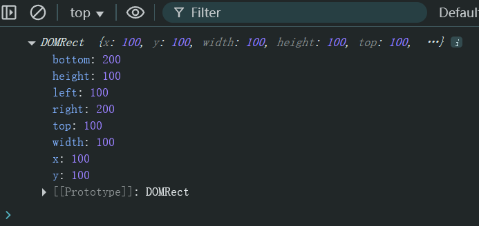

# Ch21L45 获取窗口属性，获取dom尺寸，脚本化CSS_上


## 1 获取浏览器滚动条坐标

```js
function getScollOffset() {
    if(window.pageXOffset) {
        return {
            x: window.pageXOffset,
            y: window.pageYOffset
        }
    } else {
        var html = document.documentElement;
        var body = document.body;
        return {
            x: body.scrollLeft + html.scrollLeft,
            y: body.scrollTop + html.scrollTop
        }
    }
}
```


## 2 获取可视区窗口尺寸

`<!DOCTYPE html>` 一旦删除就变为 **怪异模式（混杂模式）**，存在则为 **标准模式**。

宽度：`document.body.clientWidth` / `document.documentElement.clientWidth`；

高度：`document.body.clientHeight` / `document.documentElement.clientHeight`；

标准模式识别方法：

```js
console.log(document.compatMode); // CSS1Compat （标准模式）
                                  // BackCompat （怪异模式）
```


## 3 获取元素的几何尺寸

`elem.getBoundingClientRect()`：

```html
<style>
    .box {
        position: absolute;
        top: 100px;
        left: 100px;
        width: 100px;
        height: 100px;
        background-color: red;
    }
</style>
<div class="box"></div>
<script>
    const div = document.querySelector('.box');
    console.log(div.getBoundingClientRect());
</script>
```

实测结果：



注意：该属性 **不是实时的**。

新版方法（不含 `margin`）：

`dom.offsetWidth` / `dom.offsetHeight`


## 4 解决自动阅读越划越快且无法停止的 Bug

核心思路：加锁。

```js
// 人为加锁机制：
var timer = 0;
var key = true;
start.onclick = function() {
    if(key) {
        timer = setInterval(function() {
            window.scrollBy(0, 10);
        }, 100);
        key = false;  // 关锁
    }
};
stop.onclick = function() {
    clearInterval(timer);
    key = true;  // 开锁
};
```

