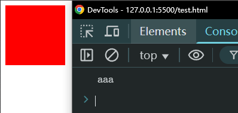
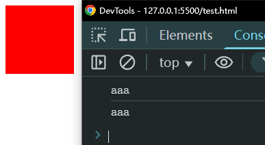

# Ch22L47 事件1（上）


## 1 关于点击事件的多次绑定

点击处理函数若为同一个，则无论绑定几次都视为同一个。除非是不同的函数实例：

```js
const div = document.querySelector('.box');
function test(ev) {
    console.log('aaa');
}
div.addEventListener('click', test, false);
div.addEventListener('click', test, false);
```

实测效果：



若改为：

```js
const div = document.querySelector('.box');
div.addEventListener('click', function (ev) {
    console.log('aaa');
}, false);
div.addEventListener('click', function (ev) {
    console.log('aaa');
}, false);
```

则按两个绑定函数处理：



> [!tip]
>
> **结论**
>
> 不能给同一个函数绑定多次点击事件。
