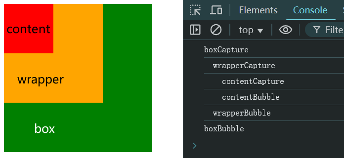

# Ch22L48 事件1（下）


## 1 自定义兼容 IE 的事件绑定函数

```js
function addEvent(elem, type, handle) {
    if(elem.addEventListener) {
        elem.addEventListener(type, handle, false);
    } else if(elem.attachEvent) {
        elem.attachEvent(`on${type}`, function(){
            handle.call(elem);
        })
    } else {
        elem[`on${type}`] = handle;
    }
}
```


## 2 绑定事件的解除

三种方式：

1. `elem.onclick = null` 或 `""` 或 `false`；
2. `elem.removeEventListener('click', fn)`（函数必须带名称）；
3. `elem.detachEvent('onclick', fn)`（IE 专用）；


## 3 事件处理模型

**事件冒泡**：结构上（非视觉上）存在嵌套关系的元素，会存在事件冒泡的功能。即同一事件，自子元素向父元素冒泡（自内向外）。

**事件捕获**：结构上（非视觉上）存在嵌套关系的元素，会存在事件捕获的功能。即同一事件，自父元素向子元素捕获（自外向内）。

触发顺序：先捕获、后冒泡。

最新 `Chrome` 浏览器中，无论冒泡事件如何提前，最内层事件执行依旧是先捕获、再冒泡，与视频讲述不一致：

```js
const box = document.querySelector('.box');
const wrapper = document.querySelector('.wrapper');
const content = document.querySelector('.content');
        
box.addEventListener('click', (e) => {
    console.log('boxBubble');
}, false);
wrapper.addEventListener('click', (e) => {
    console.log('  wrapperBubble');
}, false);
content.addEventListener('click', (e) => {
    console.log('    contentBubble');
}, false);

box.addEventListener('click', (e) => {
    console.log('boxCapture');
}, true);
wrapper.addEventListener('click', (e) => {
    console.log('  wrapperCapture');
}, true);

content.addEventListener('click', (e) => {
    console.log('    contentCapture');
}, true);
```

实测结果：




## 4 取消冒泡的方法

- `event.stopPropagation();`
- `event.cancelBubble = true;`（IE9 以下专用）


## 5 阻止默认事件

默认事件包括超链接跳转行为，或者右键弹出菜单事件。

三种方式：

1. `return false;`；
2. `event.preventDefault();`
3. `event.returnValue = false;`（IE9 以下专用）


## 6 事件源对象与事件委托机制

```js
const ul = document.querySelector('ul');
ul.onclick = function (ev) {
    const e = ev || window.event;
    const target = e.target || e.srcElement;
    console.log(target.innerText);
}
```

